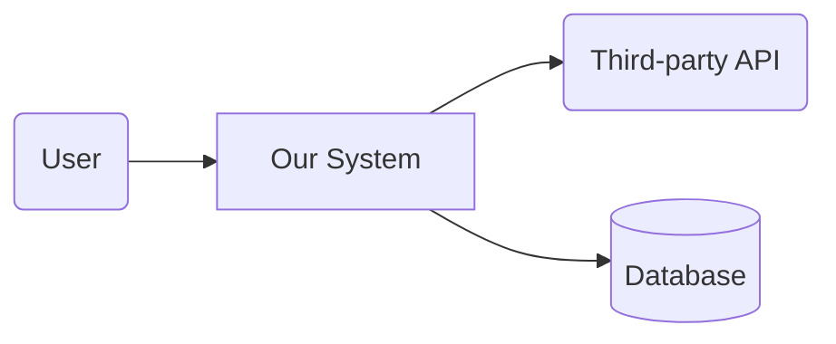

# generate-archdoc

You are populating `docs/ARCH.html`. This is the Plan-phase driver activity owned by the `architect` agent.

## Two modes

- **Greenfield mode** (no argument): design from scratch based on the PRD. Walk all sections.
- **Import mode** (argument is a path or URL to an existing ARCH artifact): analyze the source, classify content by the rubric in `WORKFLOW.md` → Importing existing artifacts, port what fits, flag what doesn't, then design only for gaps.

## Pre-flight

- Read `docs/PRD.html` — the architecture must be traceable to user stories and non-functional requirements.
- Read `CLAUDE.md` and `MILESTONES.md`. Confirm we're in the Plan phase. If not, ask the user whether to switch phases or run this as a draft.
- If `docs/ARCH.html` exists with content, treat this as a refinement pass.
- **If `$ARGUMENTS` is a path or URL to an existing ARCH artifact:** run **Import mode** below before walking the standard sections.

## Import mode (only when `$ARGUMENTS` is a source path/URL)

When a legacy architecture doc exists, your job shifts from "design from scratch" to "analyze + map + fill gaps". Run this flow once, then return to the section-by-section walk for any remaining gaps.

**a. Read the source.** Pick the right tool for the format:

- `.md` / `.markdown` / `.txt` / `.html` — Read tool directly
- `.pdf` — Read tool with `pages` parameter (max 20 per request; chunk if larger)
- Google Doc URL — `mcp__claude_ai_Google_Drive__download_file_content`
- Other formats — ask the user to convert first

**b. Parse and classify.** Split the source into sections. Classify each per the rubric in `WORKFLOW.md` → Importing existing artifacts → "Classification rubric — ARCH content". Tag each as:

- **Port directly** — content fits the framework as-is
- **Port with refinement** — fits but needs adjustment (e.g. add a Mermaid diagram; surface missing trade-offs)
- **Decompose** — too coarse (e.g. a single "Architecture" section that contains components + data flow + deployment all mashed together)
- **Relocate** — belongs in PRD.html, SECURITY.html, MILESTONES.md, or Linear instead of ARCH
- **Archive** — historical context; goes to Appendix or `docs/archive/`

**c. Surface the mapping for confirmation.** Show the user a table:

| Source section | Content type | Proposed action |
|---|---|---|
| §1 "System Overview" | System context | Port directly → ARCH §1 + add Mermaid |
| §3 "Acceptance Criteria" | Feature specs | **Relocate** → PRD + Linear |
| §6 "Threat Model" | Security architecture | **Relocate** → SECURITY.html |
| ... | ... | ... |

Ask: "Any overrides before I refactor?" Honor user preferences for ambiguous cases.

**d. Stash the original.** Move the source file to `docs/archive/<YYYY-MM-DD>__<original-filename>` (today's absolute date). For external URLs (e.g. Google Doc), download a snapshot to that path.

**e. Apply the ports.** Fill `<section>` blocks in `docs/ARCH.html` with classified+refined content. Add Mermaid diagrams where the source had only prose. Add a reference at the bottom of ARCH's Open Questions / Appendix: "Source documents: [docs/archive/...]"

**f. Queue the spillover.** For content marked "Relocate":
- → PRD.html: feed to `/generate-prd` or queue for the PM agent
- → SECURITY.html: feed to `/generate-secdoc` or queue for the seceng agent
- → `DECISIONS.md`: queue as Decision Log entry
- → Linear: queue as backlog issues

Present each queued item for one-shot batch confirmation before writing.

**g. Identify gaps.** Compare what got ported to what the framework needs:
- Are component responsibilities sentence-form and clearly owned by an Agent type?
- Are trade-offs explicit, or just "we chose X"?
- Is the deployment topology diagrammed, or only described?
- Are integration points enumerated with auth, rate limits, failure modes?
- Are there Open Questions, or is everything pretended to be decided?

Each gap becomes a design question handled in the section-by-section walk below — **but skip any section the import already filled satisfactorily.**

## Section-by-section

### 1. System Context

A one-paragraph summary + a Mermaid `flowchart` showing the system and its external actors (users, third-party services, other internal systems). This is the C4 "context" level.

### 2. Components

Break the system into 3–7 components. For each:
- Name
- Responsibility (one sentence)
- Owner (which agent during Implement: frontend-lead, backend-lead, devops-engineer)
- Key interfaces (what it exposes, what it consumes)

Mermaid `flowchart` showing component boundaries.

### 3. Data Flow

For each primary user story in the PRD, a sequence of how data moves through components. Mermaid `sequenceDiagram` per major flow.

Don't try to diagram every endpoint — only the ones that surface a non-trivial design choice.

### 4. Tech Stack & Rationale

A table:

| Layer | Choice | Why | Alternatives Considered |
|---|---|---|---|
| Frontend framework | _e.g. React + Vite_ | _team familiarity, ecosystem_ | _Svelte, Solid_ |
| Backend language | _e.g. Node + TypeScript_ | _shared types with frontend_ | _Go, Python_ |
| Data store | _e.g. Postgres_ | _relational fit, mature ops_ | _DynamoDB, SQLite_ |
| Auth | _e.g. Clerk_ | _bypass auth-as-undifferentiated-work_ | _Auth.js, Cognito_ |
| Hosting | _e.g. Vercel + Railway_ | _zero-ops for v1_ | _Fly.io, AWS_ |

**Justify every row.** "We know it" is a valid reason, but write it down.

### 5. Deployment Topology

Diagram (Mermaid `flowchart`) showing environments (dev, staging, prod), how services connect, and where the trust boundaries are.

### 6. CI/CD Pipeline

High-level: branches, merge strategy, deploy triggers, gates. DevOps fills the details, you sketch the shape.

### 7. Integration Points

For each third-party integration:
- What it does
- Auth model (OAuth? API key?)
- Rate limits / quotas relevant to our usage
- Failure mode if it's down (degrade? error? cache?)

### 8. Trade-offs & Alternatives

For each major design decision: what we chose, what we rejected, and the reason in one or two sentences. This is the "future-self memory" — when someone asks "why did we use X?", this section answers.

### 9. Open Questions

Anything we can't pin down yet. Each gets a one-line description and an owner (which agent will resolve it, by when).

## Producing diagrams

- **Default to embedded Mermaid** in the HTML — works offline, diffs cleanly in git.
- For diagrams that need richer formatting, real-time collaboration, or live updates during meetings, use the `figma-generate-diagram` skill and link the FigJam URL into the doc.

## Writing to HTML

Update `docs/ARCH.html` in place. Preserve the head, stylesheet link, and Mermaid loader. Each section is a `<section data-section="<name>">` block.

## When you finish

1. Cross-check: does every PRD user story have a corresponding data-flow diagram or component responsibility? Flag gaps in Open Questions.
2. Run `SendMessage` to the `seceng` teammate: "ARCH v1 is ready for joint threat-model review." SecEng will produce SECURITY.html.
3. `/open-doc docs/ARCH.html` for user review.
4. After both ARCH and SECURITY are approved, log the Plan→Implement transition in `MILESTONES.md`.
