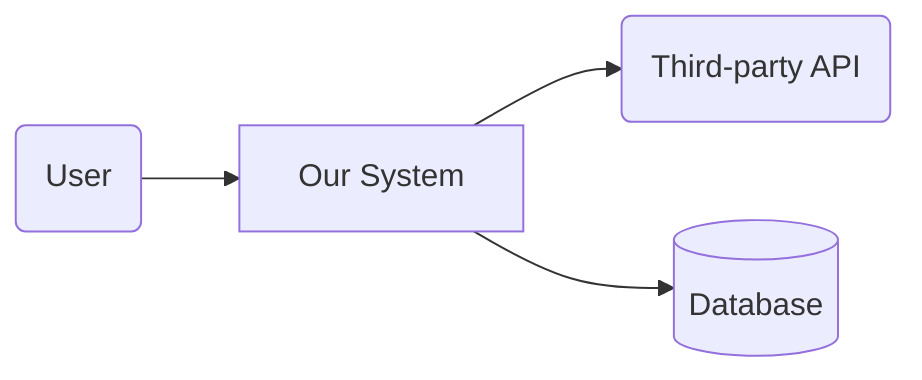

# generate-archdoc

You are populating `docs/ARCH.html`. This is the Plan-phase driver activity owned by the `architect` agent.

## Pre-flight

- Read `docs/PRD.html` — the architecture must be traceable to user stories and non-functional requirements.
- Read `CLAUDE.md` and `MILESTONES.md`. Confirm we're in the Plan phase. If not, ask the user whether to switch phases or run this as a draft.
- If `docs/ARCH.html` exists with content, treat this as a refinement pass.

## Section-by-section

### 1. System Context

A one-paragraph summary + a Mermaid `flowchart` showing the system and its external actors (users, third-party services, other internal systems). This is the C4 "context" level.

### 2. Components

Break the system into 3–7 components. For each:
- Name
- Responsibility (one sentence)
- Owner (which agent during Implement: frontend-lead, backend-lead, devops-engineer)
- Key interfaces (what it exposes, what it consumes)

Mermaid `flowchart` showing component boundaries.

### 3. Data Flow

For each primary user story in the PRD, a sequence of how data moves through components. Mermaid `sequenceDiagram` per major flow.

Don't try to diagram every endpoint — only the ones that surface a non-trivial design choice.

### 4. Tech Stack & Rationale

A table:

| Layer | Choice | Why | Alternatives Considered |
|---|---|---|---|
| Frontend framework | _e.g. React + Vite_ | _team familiarity, ecosystem_ | _Svelte, Solid_ |
| Backend language | _e.g. Node + TypeScript_ | _shared types with frontend_ | _Go, Python_ |
| Data store | _e.g. Postgres_ | _relational fit, mature ops_ | _DynamoDB, SQLite_ |
| Auth | _e.g. Clerk_ | _bypass auth-as-undifferentiated-work_ | _Auth.js, Cognito_ |
| Hosting | _e.g. Vercel + Railway_ | _zero-ops for v1_ | _Fly.io, AWS_ |

**Justify every row.** "We know it" is a valid reason, but write it down.

### 5. Deployment Topology

Diagram (Mermaid `flowchart`) showing environments (dev, staging, prod), how services connect, and where the trust boundaries are.

### 6. CI/CD Pipeline

High-level: branches, merge strategy, deploy triggers, gates. DevOps fills the details, you sketch the shape.

### 7. Integration Points

For each third-party integration:
- What it does
- Auth model (OAuth? API key?)
- Rate limits / quotas relevant to our usage
- Failure mode if it's down (degrade? error? cache?)

### 8. Trade-offs & Alternatives

For each major design decision: what we chose, what we rejected, and the reason in one or two sentences. This is the "future-self memory" — when someone asks "why did we use X?", this section answers.

### 9. Open Questions

Anything we can't pin down yet. Each gets a one-line description and an owner (which agent will resolve it, by when).

## Producing diagrams

- **Default to embedded Mermaid** in the HTML — works offline, diffs cleanly in git.
- For diagrams that need richer formatting, real-time collaboration, or live updates during meetings, use the `figma-generate-diagram` skill and link the FigJam URL into the doc.

## Writing to HTML

Update `docs/ARCH.html` in place. Preserve the head, stylesheet link, and Mermaid loader. Each section is a `<section data-section="<name>">` block.

## When you finish

1. Cross-check: does every PRD user story have a corresponding data-flow diagram or component responsibility? Flag gaps in Open Questions.
2. Run `SendMessage` to the `secops` teammate: "ARCH v1 is ready for joint threat-model review." Secops will produce SECURITY.html.
3. `/open-doc docs/ARCH.html` for user review.
4. After both ARCH and SECURITY are approved, log the Plan→Implement transition in `MILESTONES.md`.
