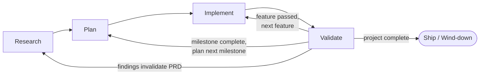
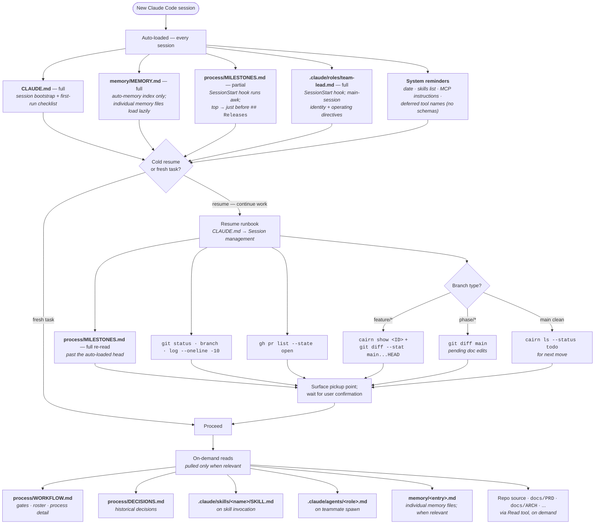

# project_template

> A reusable Claude Code starter for running new projects with an AGILE-grounded workflow, a team of specialist Agents, and consistent artifacts — from PRD through release.

## What this is

This repo is a **meta-template**, not a product. Clone it (or use it as a GitHub template) to seed a new project with:

- a four-phase workflow (**Research → Plan → Implement ⇄ Validate**),
- nine specialist team-Agents (PM, UX, Architect, SecEng, two implementation leads + a generalist, QA, DevOps) plus an `mcp-broker` context-firewall agent,
- doc-generation skills for PRD / Architecture / Security / Design,
- workflow skills for branching, PR + tracker integration, releases,
- HTML doc templates with embedded Mermaid diagrams,
- a state ledger (`process/MILESTONES.md`) and a separate append-only decision log (`process/DECISIONS.md`),
- **AGILE issue / milestone tracking via cairn** — a file-based tracker that ships inside the template (`process/TRACKER.md`): majors / milestones / issues as markdown-in-git, a local Kanban board, no caps, no accounts, zero MCP (semver `MAJOR.MINOR.PATCH` binds to those layers; Session Cycles are a heuristic with no tracker footprint),
- session-management heuristics tuned for asynchronous solo development.

The goal: every new project starts with the same shape, so async hand-offs and context-window management are predictable.

## Workflow at a glance


```mermaid
flowchart LR
  R[Research] --> P[Plan]
  P --> I[Implement]
  I --> V[Validate]
  V -->|feature passed,<br/>next feature| I
  V -->|milestone complete,<br/>plan next milestone| P
  V -->|findings invalidate PRD| R
  V -->|project complete| done([Ship / Wind-down])
```

Implement ⇄ Validate is the inner loop at three scales: **feature → milestone → major line**. Session Cycles (context-bounded work sessions, not tracker artifacts) are a heuristic planning wrapper, not a loop scale. Full details in [`process/WORKFLOW.md`](process/WORKFLOW.md).

## What you get

**Workflow Agents** (`.claude/agents/`):

| Agent | Owns | Drives |
|---|---|---|
| `product-manager` | PRD | Research |
| `ux-designer` | wireframes, interaction design | late Research, Implement consult |
| `architect` | ARCH doc, system design | Plan |
| `seceng` | SECURITY doc, threat model, gating | Plan + Validate |
| `frontend-lead` | UI implementation | Implement |
| `backend-lead` | API / service implementation | Implement |
| `implementation-lead` | generalist (CLI / lib / ML / data) | Implement (non-web projects) |
| `qa-engineer` | tests, acceptance, release readiness | Validate (TDD entry-point) |
| `devops-engineer` | CI/CD, deploy, observability | Plan + Validate |

**Skills** (`.claude/skills/`):

*Doc generation & review:*

- `/generate-prd [source]` — interview-driven PRD generation (chatprd.ai-grounded). Accepts optional path to an existing PRD artifact (markdown / HTML / PDF / Google Doc) for **import mode**: analyzes the legacy content, maps it to the AGILE framework, ports what fits, flags what doesn't.
- `/generate-archdoc [source]` — Architecture doc with Mermaid diagrams. Same import-mode support as `generate-prd` for legacy ARCH artifacts.
- `/generate-secdoc` — STRIDE-based threat model + controls
- `/generate-designdoc` — Design System & UX doc (`docs/DESIGN/`): principles, tokens (`tokens.css`), component styles (`screen.css`), `design-system-spec.md`, flows, wireframes, styled screens. Driven by `ux-designer`; cross-phase; pairs with Figma.
- `/refine-doc <PRD|ARCH|SECURITY|DESIGN>` — walks `docs/<DOC>/comments.md` (gitignored review sidecar), addresses each `## §<section-id>` comment in the matching HTML section, removes addressed comments as it goes. Composable with `/start-doc-update` → `/finish-doc-update` → `/merge-pr`. See process/WORKFLOW.md → Doc review loop.
- `/serve-docs [PRD|ARCH|SECURITY|DESIGN|stop|status]` — starts `scripts/serve-docs.sh` in the background under the Claude session (no separate terminal needed) so the inline comment widget activates in the HTML docs. Pass a doc name to also open it in the browser. Server is cleaned up automatically on `/exit`.
- `/open-doc` — open HTML/Markdown docs in default viewer
- `/export-doc [PRD|ARCH|SECURITY|DESIGN]` — render an HTML doc to a standalone, portable PDF via `scripts/export-pdf.sh` (Mermaid diagrams included; defaults to all four). GitHub renders the PDF inline where it won't render the raw HTML.

*Workflow & operations:*

- `/start-feature` — branch + cairn issue claim + Implement team spawn
- `/finish-feature` — commit, push, PR, flip the issue to in-review, hand off to Validate
- `/drive [issue|milestone]` — aims a hands-off goal-driven loop at the next feature (or whole milestone), per the project's delivery-autonomy setting (`stop-at-merge` default / `self-merge-within-milestone`). Constructs the condition for the native `/goal` command and surfaces it for you to paste — the loop then runs the I↔V cycle until done. Needs Claude Code ≥ v2.1.139 (for `/goal`). See process/WORKFLOW.md → Goal-driven loop
- `/start-doc-update <slug>` — kicks off a `phase/<phase>-<slug>` branch for non-feature doc edits (PRD/ARCH/SECURITY/WORKFLOW/etc.); no tracker issue, no implementation team
- `/finish-doc-update` — commit + push + open PR for a doc-update branch; no QA handshake (lead reviews directly)
- `/merge-pr` — gated team-lead merge after QA sign-off (features) or lead review (doc updates); squash-merges, archives, updates state. Alternative to human-review-and-merge via GitHub UI
- `/setup-tracker` — bootstrap cairn for a new project (one-time): confirms the issue-ID prefix, scaffolds `process/cairn/`, seeds the founding major + M0/M1 milestones, optionally seeds PRD stories as backlog issues
- `/cairn` — start the local Kanban/list board (`http://localhost:8766/`); a stateless lens over `process/cairn/` — agents never need it
- `/setup-claude-deploy-key` — generate a per-repo passphrase-less SSH deploy key so Claude can push to GitHub without TTY-unlockable passphrases (one-time per repo)
- `/sweep-temp [status]` — interactive sweep of the gitignored `temp/` hand-off buffer: every unplaced agent finding gets placed into a tracked artifact, discarded with a rationale, or explicitly held (`hold-until:` frontmatter). Team-lead session-close obligation; a SessionStart hook reports the pending count (14-day staleness threshold; visibility only, never auto-deletion). `status` = read-only inventory. See process/WORKFLOW.md → Hand-off protocol & the `temp/` buffer
- `/spin-off-component <path>` — extract a substantial, reusable component out of the monorepo into its own repo (a fresh template instance with its own tracker), preserving git history, cutting `v0.1.0`, and recording the parent↔child linkage. Mechanizes the git extraction; hands off the child bootstrap and the parent-side dependency swap. See process/WORKFLOW.md → Shared / reusable components

**Scripts** (`scripts/`):

- `scripts/serve-docs.sh` — wrapper that runs `scripts/serve-docs.py`, a stdlib-only Python server at `http://localhost:8765` that activates an **inline comment widget** in the HTML docs. Click `+ Comment` next to any section heading, type, save — the widget POSTs to the server which appends to `docs/<DOC>/comments.md`. Same format as hand-edited comments; both feed `/refine-doc`. See process/WORKFLOW.md → Doc review loop → Inline-authoring mode.
- `scripts/export-pdf.sh` + `scripts/print-pdf.mjs` — the PDF-export toolchain behind `/export-doc`. `export-pdf.sh` briefly starts the docs server and drives headless Chrome (via the Node `print-pdf.mjs` driver, which waits until Mermaid diagrams have actually rendered) to print each doc to a standalone PDF. Headless Chrome is required because only a real browser engine executes the JS that draws the Mermaid diagrams.
- `scripts/vendor-mermaid.sh` — downloads Mermaid to `docs/_assets/vendor/` for projects that can't rely on CDN access at doc-view time (see Mermaid loading section above).

**Artifacts** (top level + `docs/`):

- `CLAUDE.md` — session-bootstrap context (loaded automatically)
- `process/WORKFLOW.md` — phases, roles, gates, team coordination
- `process/MILESTONES.md` — live state ledger (compact; auto-loaded)
- `process/DECISIONS.md` — append-only decision log (not auto-loaded; pulled in when historical context is needed)
- `process/cairn/` — the tracker's data: majors, milestones, issues, archive (`process/TRACKER.md` is the spec)
- `docs/PRD/index.html` — Product Requirements (HTML + Mermaid)
- `docs/ARCH/index.html` — Architecture + Infrastructure
- `docs/SECURITY/index.html` — Security + Compliance
- `docs/DESIGN/index.html` — Design System & UX (tokens.css, screen.css, spec, flows, wireframes, styled-screens)
- `docs/archive/` — stashed originals of imported PRD/ARCH artifacts
- `docs/_assets/` — shared CSS + Mermaid loader

## Roles

- **Principal** (you) — sets vision, makes gate decisions, authorizes Agents.
- **Team Lead** — the main Claude Code session. Coordinates teams, delegates, summarizes specialist output into executive language. Not spawnable: its identity and operating directives live in [`.claude/roles/team-lead.md`](.claude/roles/team-lead.md), injected at session start by a `SessionStart` hook.
- **Agents** — nine specialists spawned per phase as Claude team-agents, plus the `mcp-broker` utility agent (a context firewall for verbose remote MCP servers like Google Drive and Gmail — delegate a query, get back the distilled fact instead of kilobytes of JSON). Every agent reports back through a shared **hand-off protocol**: conclusions, not evidence — a fixed Summary / Paths changed / Broken / Bubble-up format, with long findings routed to gitignored, date-prefixed `temp/` files that the team-lead places into tracked artifacts (or discards) before session close via `/sweep-temp`.

## Common project-specific extensions

The nine-Agent roster is the **floor, not the ceiling**. Some domains benefit from additional specialists. Spin up a new agent file in `.claude/agents/` (copying an existing one as a starting template) and document the addition in your project's `process/DECISIONS.md`. Examples that have come up in practice:

| Extension | When to add | What it owns |
|---|---|---|
| **`visual-designer`** | Trust-driven UI (fintech, healthcare, regulated builds) where visual polish is functional, not decorative. Distinct from the generic `ux-designer`. | Design tokens, typography, color, spacing. Palette-and-typography lock with the Principal. Flags missing components back to UX rather than designing around the gap. |
| **`compliance-officer`** | Regulated builds (HIPAA, SOC 2, PCI-DSS, FedRAMP) where compliance evidence isn't a side-effect of security work. | Compliance evidence trails, audit prep, control mapping, attestation packages. Distinct from the generic `seceng`. |
| **`data-pipeline-lead`** | ML / ETL / analytics projects with substantial data-engineering surface. | Ingestion, transformation, lineage, data quality. Distinct from the generic `implementation-lead`. |

These are **suggestions, not bundled assets** — the template doesn't ship the agent files for them. Adopt the role pattern; write the file when your project actually exercises the work.

## Customizing doc preview

The `/open-doc` skill routes by extension: `.html` → browser (Chrome → Safari fallback on macOS), `.md` → One Markdown app (if installed) with editor fallback. This works for most macOS users but can be swapped:

- **Why Chrome → Safari (not the system default)?** On macOS, LaunchServices can route `.html` files through MacVim, VS Code, or any other app the user accidentally set as default. Using `open -a "Google Chrome"` (with Safari as fallback) bypasses that and ensures HTML docs always render in a real browser.
- **Use a different default browser** (Firefox, Arc, Brave, etc.) → edit the `.html` route in `.claude/skills/open-doc/SKILL.md` step 2: change `"Google Chrome"` to `"Firefox"` / `"Arc"` / `"Brave Browser"` etc. Keep Safari as the fallback (it's always present on macOS).
- **Use a different Markdown viewer** (Bear, IDE preview, `mdcat`, `glow`) → edit the same SKILL.md and replace the `open-one-markdown` route with your tool of choice.
- **Headless / SSH session** → replace the `open -a` calls with a terminal-friendly viewer (`w3m -dump`, `lynx`, etc.) or a network-share path.
- **Project-specific viewer skill** → if your project needs a non-default workflow (e.g. opening every artifact through a specific tool chain), add a project-local skill alongside `/open-doc`. The template won't fight you.

## Quick start

### Use as a GitHub template

1. Click **Use this template** on GitHub → **Create a new repository**.
2. Clone your new repo locally and `cd` in.
3. Start a Claude Code session — `CLAUDE.md` will load automatically and walk through the [First-run / bootstrap checklist](CLAUDE.md#first-run--bootstrap).

### Or clone manually

```bash
gh repo create my-new-project --template richmosko/project_template --private --clone
cd my-new-project
claude
```

### First-run checklist (abridged — see [`CLAUDE.md`](CLAUDE.md))

1. `gh auth status` — confirm GitHub auth.
2. **`/setup-claude-deploy-key`** — generate a passphrase-less SSH key scoped to this repo, add it to GitHub as a deploy key with write access, and pin the repo's git to use it. Without this, Claude's `git push` will fail when your main SSH key is passphrase-protected.
3. **Enable GitHub branch protection on `main`** — Settings → Branches → Add rule → ✅ Require pull request before merging, ✅ Do not allow bypassing. This is the hard enforcement layer behind the workflow's "no direct pushes" rule.
4. Replace the project description placeholders in `CLAUDE.md`.
5. `/setup-tracker` — bootstrap cairn (confirm the issue-ID prefix; seeds V1 + M0/M1).
6. Verify `teammateMode` in `.claude/settings.json` (default: `tmux` for split-pane).
7. Spawn the Research team: _"Create an agent team for the Research phase."_
8. `/generate-prd` — start the discovery interview.

## Session startup

Every session starts minimal. Only the files needed to re-orient are auto-loaded; everything else is read lazily as the work demands. Three `SessionStart` hooks in `.claude/settings.json` do the injection: the first loads the team-lead role definition (`.claude/roles/team-lead.md` — main-session identity; spawned teammates keep their own agent-file identity), the second runs an `awk` extractor over `process/MILESTONES.md` so the auto-loaded state slice stays compact even as the Session Cycles and Releases tables grow, and the third reports the `temp/` hand-off buffer's pending count whenever it's non-empty (silent when clean).


```mermaid
flowchart TD
  S0([New Claude Code session])

  S0 --> A["Auto-loaded — every session"]

  A --> A1["<b>CLAUDE.md</b> — full<br/><i>session bootstrap + first-run checklist</i>"]
  A --> A2["<b>memory/MEMORY.md</b> — full<br/><i>auto-memory index only;<br/>individual memory files load lazily</i>"]
  A --> A3["<b>process/MILESTONES.md</b> — partial<br/><i>SessionStart hook runs awk;<br/>top → just before</i> <code>## Releases</code>"]
  A --> A4["<b>.claude/roles/team-lead.md</b> — full<br/><i>SessionStart hook; main-session<br/>identity + operating directives</i>"]
  A --> A5["<b>System reminders</b><br/><i>date · skills list · MCP instructions ·<br/>deferred tool names (no schemas)</i>"]

  A1 --> Q{"Cold resume<br/>or fresh task?"}
  A2 --> Q
  A3 --> Q
  A4 --> Q
  A5 --> Q

  Q -->|resume — continue work| RB["Resume runbook<br/><i>CLAUDE.md → Session management</i>"]

  RB --> R1["<b>process/MILESTONES.md</b> — full re-read<br/><i>past the auto-loaded head</i>"]
  RB --> R2["<code>git status · branch · log --oneline -10</code>"]
  RB --> R3["<code>gh pr list --state open</code>"]
  RB --> BR{"Branch type?"}

  BR -->|feature/*| R5["<code>cairn show &lt;ID&gt;</code> +<br/><code>git diff --stat main...HEAD</code>"]
  BR -->|phase/*| R6["<code>git diff main</code><br/><i>pending doc edits</i>"]
  BR -->|main clean| R7["<code>cairn ls --status todo</code><br/><i>for next move</i>"]

  R1 --> CONF["Surface pickup point;<br/>wait for user confirmation"]
  R2 --> CONF
  R3 --> CONF
  R5 --> CONF
  R6 --> CONF
  R7 --> CONF

  Q -->|fresh task| W["Proceed"]
  CONF --> W

  W --> LZ["On-demand reads<br/><i>pulled only when relevant</i>"]

  LZ --> L1["<b>process/WORKFLOW.md</b><br/><i>gates · roster · process detail</i>"]
  LZ --> L2["<b>process/DECISIONS.md</b><br/><i>historical decisions</i>"]
  LZ --> L3["<b>.claude/skills/&lt;name&gt;/SKILL.md</b><br/><i>on skill invocation</i>"]
  LZ --> L4["<b>.claude/agents/&lt;role&gt;.md</b><br/><i>on teammate spawn</i>"]
  LZ --> L5["<b>memory/&lt;entry&gt;.md</b><br/><i>individual memory files; when relevant</i>"]
  LZ --> L6["Repo source · <code>docs/PRD</code> · <code>docs/ARCH</code> · ...<br/><i>via Read tool, on demand</i>"]
```

The **Resume runbook** (in `CLAUDE.md` → Session management) only fires when the lead is re-entering in-flight work — a "let's continue" cold start. Fresh tasks skip it. Either way, the bulk of the repo — `process/WORKFLOW.md`, `process/DECISIONS.md`, individual skill / agent / memory files, docs, source — is pulled only when the work in front of you needs it, keeping the context window honest.

## The hierarchy (cairn mapping + semver)

| Concept | cairn artifact | Version digit |
|---|---|---|
| Major version line (`V1`, `V2`, …) | `process/cairn/majors/<id>.md` (one per major; concurrent) | `MAJOR` |
| Milestone (named by target version) | `process/cairn/milestones/<name>.md` | `MINOR` |
| Feature (one PR, one I↔V loop) | `process/cairn/issues/<ID>.md` | — |
| Hotfix | issue on the milestone it patches | `PATCH` |
| Session Cycle (context-bounded session) | *(none — heuristic)* | — |

The tracker is **per-repo, files in git** — no accounts, no caps, no MCP. Each **major line** gets its own `majors/` file, so `V1.x` maintenance and `V2.x` development run concurrently; a major closes (`status: completed`) when its line is EOL'd. Session Cycles are a session-planning heuristic with **no** tracker artifact. Agent attribution is the issue's `assignee:` field plus per-author comment headers. View it all on the local board (`/cairn` → `http://localhost:8766/`). Full semver rules in [`process/WORKFLOW.md`](process/WORKFLOW.md) → Versioning scheme; full tracker spec in [`process/TRACKER.md`](process/TRACKER.md).

A **reusable component** that graduates to its own repo (via `/spin-off-component`) brings its own tracker with it (`/setup-tracker` in the child) — same machinery, no new infra. See process/WORKFLOW.md → Shared / reusable components.

## Layout

```
.
├── CLAUDE.md                    auto-loaded session context
├── README.md                    this file
├── LICENSE
├── process/                     workflow definition + live project state
│   ├── WORKFLOW.md              phases, roles, gates, coordination
│   ├── MILESTONES.md            live state + decision ledger
│   ├── DECISIONS.md             append-only project decisions (seed; you keep this)
│   ├── TRACKER.md               cairn spec — the file-based issue tracker
│   ├── cairn/                   tracker data: majors, milestones, issues, archive
│   └── TEMPLATE_DECISIONS.md    decisions about the template itself — DELETE on bootstrap
├── docs/
│   ├── PRD/index.html           product requirements (Research)
│   ├── ARCH/index.html          architecture (Plan)
│   ├── SECURITY/index.html      security (Plan + Validate)
│   ├── DESIGN/                  design system & UX (cross-phase; ux-designer)
│   ├── starting-prompt.md       original design notes (kept for posterity)
│   └── _assets/                 shared CSS + Mermaid loader
│   (each doc lives in its own subdir — add per-doc images / diagrams /
│    sub-pages alongside the index.html as the doc grows)
├── scripts/                     repo-level helpers (vendor-mermaid.sh, serve-docs.sh, …)
└── .claude/
    ├── settings.json            hooks, env, permissions, teammateMode
    ├── agents/                  9 specialists + mcp-broker utility agent
    ├── roles/                   team-lead role (main-session identity, hook-injected)
    └── skills/                  workflow + doc-gen skills
```

## Requirements

### Tooling

- **Claude Code v2.1.32 or later** — required for the experimental team-agents feature. Check with `claude --version`.
- **macOS or Linux shell** — workflow skills assume POSIX + standard CLI tools (`bash`/`zsh`, `git`, `gh`, `open`/`xdg-open`).
- **GitHub CLI** (`gh`) — authenticated to the account that will host your new project (`gh auth status` should succeed; `gh auth login` if not).
- **Git** — modern enough to support worktrees and standard branching.
- *(Optional)* **tmux or iTerm2** — required only for split-pane teammate mode (the default). Without one of these, switch `teammateMode` to `"in-process"` in `.claude/settings.json`.
- *(Optional)* **One Markdown** macOS app — nicer rendered viewing of `.md` files via the `open-one-markdown` skill. Falls back to your `$EDITOR` if not installed.

### Recommended (quality-of-life)

Not required, but strongly improve visibility while working alongside Claude Code:

- **[Oh My Zsh](https://ohmyz.sh/)** — Zsh framework with themes that surface **git branch + dirty/clean status** in your shell prompt. Makes it obvious at a glance whether you're on `main` vs a `feature/...` branch, and whether you have uncommitted changes. Install with the one-line curl on their site; pick a theme like `agnoster` or `robbyrussell` that shows git state.
- **Custom Claude Code statusline** — Claude Code can render a customizable bottom status line showing the model in use, context usage, session cost, and git status, driven by a script you provide (e.g. `~/.claude/statusline-command.sh`). See the [official walkthrough](https://code.claude.com/docs/en/statusline.md). **Easiest setup:** run `/statusline` inside Claude Code, describe what you want in natural language, and the setup agent generates the script and wires up `~/.claude/settings.json` for you.

- **Async notifications when Agents wait on you** — Critical when work is asynchronous and you've stepped away. Claude Code fires a `Notification` hook on permission prompts, idle waits, and gate decisions; wire it in `~/.claude/settings.json` to route the alert wherever. The hook receives JSON on stdin (`message`, `notification_type`, etc.) — scope it via the `matcher` field (e.g. `permission_prompt`, `idle_prompt`). Practical destinations:
  - **iTerm2 + macOS banner** — wire the hook to `osascript -e 'display notification "$msg" with title "Claude Code"'`. macOS Notification Center shows the banner whether or not iTerm2 has focus; respects Focus Mode. Enable iTerm2 → Settings → Profiles → Terminal → "Silence bell" off if you also want terminal-level signals. iTerm2's [Triggers](https://iterm2.com/documentation-triggers.html) feature can fire on output patterns independent of the hook.
  - **[`terminal-notifier`](https://github.com/julienXX/terminal-notifier)** (`brew install terminal-notifier`) — richer macOS notification UI than `osascript`; supports icons, sounds, click-through actions. Drop-in replacement in the hook command.
  - **[ntfy.sh](https://ntfy.sh/) / [Pushover](https://pushover.net/)** — HTTP push to your phone for true away-from-desk async alerts. Hook becomes a `curl` POST to their endpoint; no app/account setup beyond their free tiers.
  - **Slack or Discord webhook** — for team visibility or an audit trail of human-decision points. HTTP POST from the hook to an incoming-webhook URL.
  
  Reference: [Claude Code hooks docs](https://code.claude.com/docs/en/hooks.md). The `Notification` event is observability-only (no decision control), so the hook can't block Claude — it just alerts you.

### Claude Code configuration

The template **pre-sets** project-level config in `.claude/settings.json`:

| Setting | Value | Purpose |
|---|---|---|
| `env.CLAUDE_CODE_EXPERIMENTAL_AGENT_TEAMS` | `"1"` | Enables team-agents (mailbox, shared task list, peer SendMessage). |
| `teammateMode` | `"tmux"` | Split-pane teammates; survives `/resume` (see [`CLAUDE.md`](CLAUDE.md) for mode trade-offs). |
| `hooks.SessionStart` | injects `.claude/roles/team-lead.md` + reads `process/MILESTONES.md` + reports `temp/` | Loads the team-lead role (main-session identity), auto-surfaces current project state, and nags on unplaced `temp/` hand-off files at session start. |
| `permissions.allow` | common read/git commands | Reduces permission prompts for routine ops. |

**Verify in your user-level config (`~/.claude/settings.json`):**

- That you haven't overridden `CLAUDE_CODE_EXPERIMENTAL_AGENT_TEAMS` to `"0"`. If you have, the project-level setting will be honored, but expect surprise if you switch projects.
- That `teammateMode` aligns with your terminal — `"tmux"` requires tmux *or* iTerm2 with `it2` CLI; otherwise use `"in-process"`.

If you prefer to override anything per-project without committing, drop it in `.claude/settings.local.json` (gitignored).

### External integrations

- **No tracker service needed** — cairn ships inside the template: issue tracking is markdown files in the repo, the board is a local Python-stdlib server (`/cairn`), and macOS's stock `python3` suffices. (Linear-era projects: the deprecated `/setup-linear-team` / `/sync-backlog` / `/cleanup-linear` skills remain for one release; `/setup-tracker` imports a legacy `process/BACKLOG.md`.)
- **Anthropic API access** — implicit via Claude Code itself; no additional config.

### Mermaid loading: CDN vs vendored

The HTML doc templates (`docs/PRD/index.html`, `docs/ARCH/index.html`, `docs/SECURITY/index.html`) load Mermaid via `docs/_assets/mermaid-init.js`. The template ships with the **CDN variant** — fetches Mermaid from `cdn.jsdelivr.net` at doc-view time. Works out of the box; requires internet access to render diagrams.

For projects that can't rely on CDN access — **regulated builds (fintech, healthcare), offline / air-gapped workflows, security-conscious postures** — swap to the vendored variant:

```bash
./scripts/vendor-mermaid.sh
```

The script:
- Downloads the Mermaid UMD bundle to `docs/_assets/vendor/mermaid.min.js` (defaults to pinned major version; override with `MERMAID_VERSION=11.4.0` etc.)
- Rewrites `docs/_assets/mermaid-init.js` to load from the local bundle instead of the CDN
- Uses the UMD build (not ESM) so `file://` URLs work — you can still double-click the HTML docs from Finder

The vendor directory is **gitignored by default** at the template level so the template itself doesn't carry the bundle. Downstream projects can either:
- Leave it gitignored and document `./scripts/vendor-mermaid.sh` as a setup step (the script is idempotent), or
- Un-ignore `docs/_assets/vendor/` in their own `.gitignore` to commit the bundle into their repo.

Revert to CDN at any time: `git checkout docs/_assets/mermaid-init.js && rm -rf docs/_assets/vendor/`.

### Optional for richer artifacts

- **Figma MCP** + **Figma plugin** — required only if the `ux-designer` Agent will produce wireframes / Code Connect mappings (skills under `figma:*`).
- **Modern browser** — for viewing the generated HTML docs (`docs/PRD/index.html` etc.). They're self-contained; default-CDN variant needs internet on first open, vendored variant works offline.

## Where to read next

- [`CLAUDE.md`](CLAUDE.md) — session bootstrap, first-run checklist, session-management heuristics.
- [`process/WORKFLOW.md`](process/WORKFLOW.md) — phases, roles, tracker mapping, team coordination, decision logging, release process, deployment topology.
- [`process/MILESTONES.md`](process/MILESTONES.md) — live state-ledger structure.
- [`process/DECISIONS.md`](process/DECISIONS.md) — append-only decision log; conventions in process/WORKFLOW.md → Decision logging.
- [`process/TRACKER.md`](process/TRACKER.md) — cairn: data model, board server, CLI, and the skills that ride on it.
- [`docs/starting-prompt.md`](docs/starting-prompt.md) — the original design brief that shaped this template.

## License

MIT — see [`LICENSE`](LICENSE).

Projects instantiated from this template can adopt whatever license suits them; the template itself is MIT-licensed so you can fork, modify, and reuse without friction.

## Contributing

This is a living template. Improvements made inside any project derived from it can be ported back here so future projects benefit. Open a PR or fork freely.
