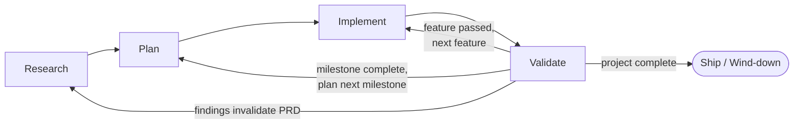

# Workflow

> The "how" of running this project. Phases, roles, artifacts, gates.

## Phase model

Every project moves through four phases. **Implement and Validate are nested loops at three scales** — from innermost to outermost: **feature → milestone → project**. The same I↔V mechanics repeat at each scale; only the size of the deliverable changes. (Sprints — Linear cycles — are a **team-wide time-bound delivery cadence** that groups features. They're an orthogonal cadence wrapper, not a loop scale: sprint boundaries are bookkeeping events, not I↔V gates.)



| Phase | Driver agent | Output artifact | Gate to next phase |
|---|---|---|---|
| **Research** | product-manager | `docs/PRD.html` (v1) | PRD covers Problem, Goals, Users, Stories, Non-Goals; user approves |
| **Plan** | architect | `docs/ARCH.html` + `docs/SECURITY.html` | ARCH covers stack, components, data flow, CI/CD; SECURITY covers threat model + controls |
| **Implement** | implementation leads (per project config — see below) | Working code on a feature branch | All tests green; code reviewed by peer agent |
| **Validate** | qa-engineer | Test results + release notes | Acceptance criteria met; SECURITY checks pass; PR merged |

A phase gate is a **human decision**, not an automated check. The lead summarizes gate evidence; the user approves the transition. Approval gets logged in [`DECISIONS.md`](DECISIONS.md).

## Project configuration

Specialist roles (PM, UX, Architect, SecEng, QA, DevOps) apply universally. The **implementation lead(s)** are tuned per project:

| Project shape | Active implementation lead(s) |
|---|---|
| Full-stack web/mobile app | `frontend-lead`, `backend-lead` |
| API or backend service only | `backend-lead` |
| Frontend-only / static site | `frontend-lead` |
| CLI, library, plugin, ML/data pipeline, single-binary service | `implementation-lead` (generalist) |
| Hybrid (e.g. CLI + web admin) | mix as appropriate |

**This project uses:** _e.g. `frontend-lead`, `backend-lead`_ — _set during Plan phase, log change as a `DECISIONS.md` entry if it shifts later._

All implementation-lead agent files ship with the template; the project just picks which are active. Inactive ones can be left in place — they cost nothing until spawned.

## Phase-by-phase

### Research

**Goal:** Decide *what* we're building and *for whom*.

- **Driver:** `product-manager`
- **Active team:** product-manager (driver), ux-designer (late in phase), seceng (consult, high-level only)
- **Activities:**
  - PM interviews the user via the `/generate-prd` skill (chatprd.ai-grounded template)
  - PM drafts user stories, success metrics, non-goals
  - UX produces wireframes / interaction sketches (late-phase, after stories stabilize)
  - SecEng surfaces regulatory and high-level security considerations (e.g. "this handles PHI" → flag for SECURITY.md later)
- **Artifact:** `docs/PRD.html`
- **Gate:** User approves PRD v1.

### Plan

**Goal:** Decide *how* we'll build, deploy, and secure it.

- **Driver:** `architect`
- **Active team:** architect (driver), seceng, devops-engineer, qa-engineer
- **Activities:**
  - Architect drafts `ARCH.html` (system context, components, data flow, tech stack, deployment topology) via `/generate-archdoc`
  - SecEng produces `SECURITY.html` via `/generate-secdoc` (threat model, trust boundaries, controls, compliance, incident response)
  - DevOps defines CI/CD topology, IaC approach, environments
  - QA proposes a test strategy (unit, integration, E2E split; coverage targets; acceptance-test framework)
  - Lead breaks the roadmap into **milestones (Linear projects) → sprints (Linear cycles) → deliverables (Linear issues)**
- **Artifacts:** `docs/ARCH.html`, `docs/SECURITY.html`, populated `MILESTONES.md`, Linear backlog
- **Gate:** ARCH + SECURITY approved; Linear backlog populated for the first milestone.

### Implement

**Goal:** Build the smallest shippable slice. Repeat.

- **Driver:** the active implementation lead(s) for this project (see **Project configuration** above)
- **Active team:** the project's implementation leads + `qa-engineer` (TDD pair)
- **Inner loop (per feature):**
  1. `/start-feature <linear-issue-id>` — creates branch, claims Linear issue, posts plan
  2. QA writes failing tests against acceptance criteria
  3. Lead writes the implementation; tests go green
  4. Peer review: another implementation specialist reads the diff via `SendMessage`. **If only one implementation lead is active for this project, the `architect` reviews instead.**
  5. `/finish-feature` — commits, pushes, opens PR, links Linear
- **Gate (per feature):** PR mergeable, tests green, peer review approved.

### Validate

**Goal:** Confirm the slice actually works for the user and is safe to ship.

- **Driver:** `qa-engineer`
- **Active team:** qa-engineer (driver), devops-engineer (release), architect (review)
- **Activities:**
  - QA runs full regression + acceptance suite
  - DevOps deploys to staging (or prod if release-ready)
  - Architect reviews for arch drift / debt accumulation
  - SecEng re-engaged if any security control was touched
- **Gate:** Acceptance criteria met → `/merge-pr` → update `MILESTONES.md`. **Tag a release only if this PR completes a release milestone** — the `/merge-pr` skill prompts; tagging is never automatic.

After a Validate cycle, we either return to Implement (next feature in the sprint) or escalate to a new Research mini-loop (if findings invalidate the PRD).

## Roles

### Principal (you)
- Sets vision, makes gate decisions, owns final approval.
- Authorizes the Agents (specialist teammates) to act on your behalf — hence "Principal" in the Principal/Agent sense.
- Asynchronous — picks up where MILESTONES.md says we left off.

### Team Lead (the main Claude session)
- Coordinates phases, spawns/tears down teammate teams, owns `WORKFLOW.md` and `MILESTONES.md`.
- **Delegate substantial domain work** to Agents via `SendMessage`; don't bypass them just to save a round-trip. (The lead still handles small operational tasks directly — running git commands, editing `MILESTONES.md`, opening files for review, etc.)
- **Translates and summarizes for the Principal.** Agents communicate in their domain's idiom (architecture trade-offs, threat-model entries, test pyramids, deploy topologies). The lead distills their output into **executive summaries** — what changed, what it means, what decision the Principal needs to make next. If an agent's reply is dense or jargon-heavy, restate it in plain language before relaying it.

### Agents (`.claude/agents/*.md`)
- See `.claude/agents/` for the nine specialist definitions and their domains.
- Each runs in its own persistent context as a teammate (requires `CLAUDE_CODE_EXPERIMENTAL_AGENT_TEAMS=1`).
- Peers communicate via `SendMessage` without going through the lead.
- Authorized by the Principal; coordinated by the Team Lead.

## Team coordination

Three distinct mechanisms, each with a different scope. Use the right one for the right job:

| Mechanism | Scope | Use for |
|---|---|---|
| **Linear** | durable, cross-session | Canonical work store — features, milestones, sprints, releases. Survives session restart. |
| **Shared task list** | session-scoped (transient) | In-session execution coordination — hand-offs, dependencies, "I'm working on X now," parallel scheduling. **Does not survive `/resume` or session end.** |
| **SendMessage / mailbox** | point-to-point | Direct questions, opinions, peer-review pings, "look at this" nudges. Lands in the recipient's mailbox automatically; no broadcast. |

### Boundary rule

- Needs to survive a session → **Linear**
- Just happening in this session → **shared task list**
- Direct question or hand-off note → **SendMessage**

### Anchor-task pattern

When a feature starts (`/start-feature`), the implementation lead creates an **anchor task** on the shared task list mirroring the Linear issue (title = feature title, description = acceptance criteria). Subtasks hang under it via `blockedBy` chains:

```
[qa-engineer]    write failing acceptance test         (anchor)
  └─ [backend-lead]  implement API endpoint            (blockedBy: qa)
       └─ [frontend-lead] wire UI to endpoint          (blockedBy: backend)
            └─ [qa-engineer]  run acceptance suite     (blockedBy: frontend)
                 └─ [devops]  deploy to staging         (blockedBy: qa)
```

Teammates claim and complete tasks; dependencies auto-unblock; the lead watches without polling. When the feature merges, the team is torn down and the shared task list naturally goes with it.

### Lead's promotion duty

Because the shared task list and mailbox are transient, the **lead promotes durable state outward** at feature/sprint/milestone boundaries:
- Shared task list → MILESTONES.md sprint notes + Linear issue comments (so a future session can reconstruct what happened)
- Mailbox exchanges containing decisions → `DECISIONS.md`
- Anything ephemeral (status pings, intermediate WIP) stays transient — that's the point.

## Tuning Agents per project

The `model` and `effort` defaults baked into each agent's frontmatter are starting points, not commandments. Three knobs let you tune per project — or even per session.

### `model` — which Claude variant the Agent runs on

| Value | Resolves to | When to use |
|---|---|---|
| `haiku` | Haiku 4.5 (200k context) | Speed/cost dominate; well-defined pattern-bound tasks |
| `sonnet` | Sonnet 4.6 (200k context) | **Default for almost everything** — implementation, dialogue, analysis on familiar patterns |
| `opus` | Opus 4.7 (200k context) | Novel system design, multi-dimensional trade-off analysis where capability is the bottleneck |
| `opus[1m]` | Opus 4.7 with **1M context** | Reasoning over a large existing codebase or many files simultaneously |
| `inherit` | Inherits from the Lead session | When you want all teammates to match the Lead's tier without naming it |

Override examples (in an agent's frontmatter):

```yaml
# Architect joining a project with a large legacy codebase
model: opus[1m]

# Backend lead working on straightforward CRUD endpoints
model: sonnet

# DevOps engineer running mostly-deterministic deploy scripts
model: haiku
```

### `effort` — reasoning budget on top of model choice

`low` / `medium` / `high`. **Independent of model.** Often the right move is **Sonnet + `effort: high`** — more reasoning depth without paying for Opus.

### Context-window cost warning

The prompt cache has a **5-minute TTL.** An Agent that idles past 5 minutes burns the cache miss on its next wake-up. A 1M cache miss is roughly **5× more expensive** than a 200k miss.

**Use `opus[1m]` only on Agents whose work pattern keeps them continuously active** — the Lead session, an Agent in active dialogue, an Agent driving an uninterrupted analysis pass. An Agent that pings once every hour or two should stay at 200k.

### Global override (one-shot sessions)

To override every spawned subagent's model in one shot (without editing each file):

```bash
export CLAUDE_CODE_SUBAGENT_MODEL=opus[1m]
```

Useful for one-off "burn the budget" sessions — e.g. an end-of-milestone architectural audit pass. Unset when done.

### Default assignments (template ships with)

| Agent | Model | Effort | Rationale |
|---|---|---|---|
| `product-manager` | `sonnet` | `high` | Discovery interviews need deep listening + scope reasoning |
| `ux-designer` | `sonnet` | `medium` | Dialogue + visual sketching; standard depth |
| `architect` | `opus` | `high` | Novel system design with many tradeoffs |
| `seceng` | `sonnet` | `high` | Threat modeling is mostly pattern-matching; effort:high covers the depth |
| `frontend-lead` | `sonnet` | `medium` | Standard implementation work |
| `backend-lead` | `sonnet` | `medium` | Standard implementation work |
| `implementation-lead` | `sonnet` | `medium` | Standard implementation work |
| `qa-engineer` | `sonnet` | `high` | Edge-case enumeration benefits from more reasoning budget |
| `devops-engineer` | `sonnet` | `medium` | CI/CD + deploy work is mostly pattern-bound |

Re-tune any of these per project; record the change as an entry in [`DECISIONS.md`](DECISIONS.md).

## Team instantiation pattern

Because of the "one active team at a time" constraint and linear token cost, **spawn only the team you need for the current phase**, then tear it down at the gate.

| Phase | Team to create |
|---|---|
| Research | `product-manager`, `ux-designer` (late), `seceng` (consult) |
| Plan | `architect`, `seceng`, `devops-engineer`, `qa-engineer` |
| Implement | active implementation leads (see **Project configuration**), `qa-engineer` |
| Validate | `qa-engineer`, `devops-engineer`, `architect` |

To create: _"Create an agent team for the Plan phase."_
To tear down: _"Clean up the team."_

## Artifact map

```
.
├── CLAUDE.md                    auto-loaded session context
├── WORKFLOW.md                  this file
├── MILESTONES.md                live state + decision ledger
├── docs/
│   ├── PRD.html                 product requirements (Research)
│   ├── ARCH.html                architecture (Plan)
│   ├── SECURITY.html            security (Plan, consult'd throughout)
│   └── _assets/                 shared CSS + mermaid loader
├── .claude/
│   ├── settings.json            hooks, env, permissions
│   ├── linear-team.json         cached Linear team id (gitignored)
│   ├── agents/                  8 specialist definitions
│   └── skills/                  workflow + doc-gen skills
└── src/, app/, lib/, etc.   source code layout decided during Plan, recorded in ARCH.html
```

## Version control & Linear

- **Git is non-negotiable.** Commit at every meaningful step. Push at every completed I→V loop.
- **Branches:** `feature/<linear-issue-id>-<kebab-slug>` for feature work (use `/start-feature`); `phase/<phase>-<slug>` for non-feature doc updates during Research/Plan or meta edits anytime (use `/start-doc-update`).
- **No direct pushes to `main`.** All changes — including doc-only updates on `phase/...` branches — merge via PR. **Two merge paths:**
  - **Human review** via GitHub's UI: review the diff, approve, click "Squash and merge."
  - **Team-lead merge** via `/merge-pr`: the user asks the lead to merge on their behalf after QA sign-off (for features) or lead's read of the diff (for doc updates). The skill verifies merge-readiness, archives the issue, updates state, and squash-merges.
  Both paths land on `main` **only** through a PR.
- **Enforce at GitHub-level.** Skills and docs are advisory — the **hard enforcement layer** is GitHub branch protection on `main` (Settings → Branches → Add rule → require pull request before merging). Enable this at first-run; without it, the workflow's "no direct pushes" rule is bypassable.
- **SSH-key setup once per repo.** Run `/setup-claude-deploy-key` on first bootstrap — it generates a passphrase-less Ed25519 key (`~/.ssh/id_ed25519_claude_<repo>`), helps you register it as a GitHub deploy key with write access, and pins the repo's git to use it via `core.sshCommand`. This eliminates `Permission denied (publickey)` failures that occur when Claude Code can't unlock your main passphrase-protected SSH key from its non-TTY bash.
- **Commits** include the Linear issue ID when applicable: `feat(ABC-123): add login flow`.
- **PRs** auto-link to Linear via the `/finish-feature` skill.
- **Linear (shared-team model):** one Linear team across **all** your projects (Linear's free tier caps you at 2 teams; we use a single shared team for the whole workspace). Each project gets its own **Initiative**. Set up via `/setup-linear-team` on first session.

| Our concept | Linear primitive |
|---|---|
| Project (overall effort, this repo) | **Initiative** (workspace-level; has target date, owner, health) |
| Milestone | Linear Project (status `Planned` → `In Progress` → `Completed`) |
| Sprint | Linear Cycle (team-wide cadence; one cycle can contain features from multiple of your projects) |
| Feature | Linear Issue (one issue = one PR = one I→V loop) |

### Process milestones vs. product milestones

Milestones come in two flavors. **Process milestones** (M0 — Bootstrap & Research, M1 — Plan) track the Research and Plan phases themselves as first-class Linear projects, seeded automatically by `/setup-linear-team`. **Product milestones** (M2+) are the actual scope chunks of the product and are populated by the `architect` during M1.

The point of giving Research and Plan their own milestones is that those phases are often as complex as a product milestone — drafting a PRD or designing an architecture generates a real backlog of sub-tasks (interview a stakeholder, sketch a flow, decide a stack). Treating them as milestones means that work is **trackable as Linear issues** with the same visibility as product work, and a fresh session sees the Roadmap populated from Day 0 instead of waiting until Plan completes.

**Subdivide if complexity warrants.** If Research turns out to be heavy, split M0 into `M0a — PRD draft`, `M0b — PRD review & refinement`. Same for M1 if Architecture vs Security warrant separate tracks. Each subdivision creates its own Linear project. The template seeds two rows as the floor, not a cap.

- **Agent attribution via labels.** Every Linear issue carries one or more `agent:<role>` labels (e.g. `agent:backend-lead`, `agent:qa-engineer`). Labels are seeded automatically by `/setup-linear-team`. This is the v1 attribution mechanism.
  - **Future upgrade — OAuth agent actors:** Linear supports OAuth-installed "agent" accounts that don't consume a billable seat and get first-class per-agent attribution in audit logs and Insights ([docs](https://linear.app/developers/agents)). Requires registering an OAuth app per agent role and re-routing MCP calls — non-trivial work. Switch only when per-agent reporting starts mattering; the label workflow keeps working alongside.
- **Free-tier issue-cap mitigation (tiered overflow):** Linear's free plan caps active (non-archived) issues at **250 across the workspace**. The template uses a tiered overflow system to stay well under:

  ```
  docs/PRD.html        BACKLOG.md          Linear active        Linear archived
  (canonical scope) →  (overflow queue) →  (≤200 hot set)   →   (cold storage)
                            FIFO by               ↓
                            milestone        promoted by /sync-backlog
                                             consumed by /start-feature
                                             archived by /cleanup-linear (or
                                             Linear's auto-archive setting)
  ```

  - **`/setup-linear-team`** seeds only the **first milestone's** stories into Linear; everything else lands in [`BACKLOG.md`](BACKLOG.md) at the repo root.
  - **`/sync-backlog`** promotes from BACKLOG.md to Linear at sprint-cycle boundaries (or on demand). FIFO by milestone stage; honors the active-issue budget.
  - **`/start-feature`** runs a budget check before creating new Linear issues. At 80% of cap (>200 active) it warns; at the cap (250) it hard-blocks and routes new items to BACKLOG.md.
  - **`/cleanup-linear`** archives Done issues on demand. Complementary to Linear's workspace **Auto-archive after N days** setting (Settings → Workflow; default 14 days) — enable it for passive cleanup.

## Importing existing artifacts

When a project comes with pre-existing PRD or ARCH documents (or similar), the `/generate-prd` and `/generate-archdoc` skills support an **import mode**: pass the source path as the skill's argument and the doc-gen flow analyzes the legacy content, maps it to the template's framework, and runs the interview **only for the gaps**.

### Why "import" rather than "replace"

Existing artifacts encode decisions, stakeholder context, and constraints that took real work to gather. Importing preserves that signal. Throwing away the legacy doc and running a greenfield interview discards it.

### Source formats supported

- `.md` / `.markdown` / `.txt` — read directly
- `.html` / `.htm` — read; HTML tags stripped for analysis
- `.pdf` — Read tool with `pages` parameter (max 20 pages per request)
- Google Docs / Drive files — `mcp__claude_ai_Google_Drive__download_file_content`
- Other formats — convert to one of the above first

### Classification rubric — PRD content

| Existing content type | Maps to | Action |
|---|---|---|
| Problem statement, motivation | PRD §1 Overview | port directly |
| Goals (qualitative) | PRD §2 Goals | port + push to quantify in interview |
| Goals (with metrics) | PRD §2 Goals | port as-is |
| User personas / audience | PRD §1 + §4 | port |
| Feature list (high-level) | PRD §4 User Stories | **decompose** into "As a X..." form |
| Feature list (detailed) | Linear backlog issues | port out of PRD entirely |
| Implementation plan / "how it works" | ARCH.html | **flag as misplaced; relocate** |
| Tech stack choices | ARCH.html | **flag as misplaced; relocate** |
| Roadmap / timeline (coarse) | MILESTONES.md + Linear projects | port + restructure |
| Roadmap / timeline (per-feature) | Linear issues | port as backlog |
| Risks / open questions | PRD §10 | port directly |
| Background / history | PRD §11 Appendix | archive |
| Out-of-scope items | PRD §3 Non-Goals | port (uncommon in legacy PRDs — a win when found) |
| Decided architectural choices | `DECISIONS.md` + ARCH §8 | extract with rationale |

### Classification rubric — ARCH content

| Existing content type | Maps to | Action |
|---|---|---|
| System overview / context | ARCH §1 System Context | port + add Mermaid diagram |
| Component breakdown / module list | ARCH §2 Components | port + add diagram |
| Data model / schema | ARCH §2 + §3 Data Flow | port |
| API spec / contracts | ARCH §2 + §3 | port; preserve detail |
| Tech stack choices | ARCH §4 Tech Stack & Rationale | port + push to add rationale if missing |
| Deployment topology | ARCH §5 Deployment Topology | port + diagram |
| CI/CD pipeline | ARCH §6 CI/CD Pipeline | port |
| Integration points | ARCH §7 Integration Points | port |
| Non-functional requirements | PRD §6 Non-Functional Requirements | **flag as misplaced; relocate** |
| Security architecture / threat model | SECURITY.html | **flag as misplaced; relocate** |
| Trade-offs / alternatives | ARCH §8 Trade-offs | port (often missing — a win when found) |
| Open questions | ARCH §9 Open Questions | port |
| Roadmap / timeline | MILESTONES.md + Linear projects | **flag as misplaced; relocate** |
| Acceptance criteria / feature specs | PRD §5 + Linear issues | **flag as misplaced; relocate** |
| Background / context / history | ARCH appendix or archive | port to appendix |

### What gets archived

Original source documents are moved to `docs/archive/<YYYY-MM-DD>__<original-filename>` and referenced from the new doc's Appendix. Stored under git for an audit trail.

### Limits and honest caveats

- **80/20 automation.** The rubric handles ~80% of content classification; the remaining ~20% needs human judgment. The skill surfaces ambiguous cases for confirmation.
- **Lossy refactoring is possible.** Some legacy content is valuable *because* it's prescriptive. The user can override the rubric per section before the refactor commits.
- **Multi-file imports.** If a project's PRD is spread across multiple files or Google Docs, run import in stages — start with the most authoritative source, layer others in.
- **AGILE pushback is welcome.** If the user disagrees with a proposed refactor (e.g. wants to preserve a waterfall roadmap), record the deviation in `DECISIONS.md`; the framework bends.

## Versioning external artifacts

The repo + git tags are the canonical record of *what shipped*. Artifacts accessed via MCP — Figma designs, Google Docs/Sheets, etc. — live outside git and have their own version history. The current APIs don't support programmatic tagging in any usable way:

| Platform | Read versions | Create / name versions via API |
|---|---|---|
| **Figma REST API** | `GET /v1/files/:key/versions` | **Not supported** — UI only |
| **Google Drive API** | `revisions.list`, `revisions.get` | Limited — `keepForever:true` works for binary files only; Docs/Sheets editor files have no API for naming revisions (UI naming works on free accounts) |
| **Linear** | Full audit log per issue, automatic | Implicit — no action needed |

So revision tagging is **manual at milestone or release boundaries**:

- **Figma** (Pro+ tiers): file menu → Save to version history → add a label (e.g. `v0.1.0 MVP designs`). *Free tier doesn't retain named versions; rely on auto-save for short-term recovery only.*
- **Google Docs / Sheets** (all tiers including free): File → Version history → "Name current version" → label it (e.g. `v0.1.0`).
- **Record the label** in the `DECISIONS.md` entry for that release so future-you can resolve "what Figma state corresponds to v0.1.0?" without guessing.

The intent is **recovery in case something goes wrong** — not perfect cross-system reproducibility. Native auto-save history covers most damage; named versions at release boundaries cover the rest. Revisit this convention if/when MCPs expose programmatic revision-tagging.

## Decision logging

Every non-trivial decision (stack pick, architecture pivot, scope cut, deferred feature, security exception) gets a one-paragraph entry in [`DECISIONS.md`](DECISIONS.md) at the repo root with:
- Date (absolute, e.g. `2026-05-20`)
- Decision (one sentence)
- Why (one or two sentences)
- Alternatives considered
- Who approved
- Supersedes (if it overturns a prior decision)

The log is **append-only**. Mistakes get a new entry that supersedes the old one — don't edit history.

`DECISIONS.md` is **not auto-loaded** into session context (unlike `MILESTONES.md`). Pull it in explicitly when you need to recall historical context — e.g. "why did we pick Postgres?" This split keeps the live-state ledger lean and lets the decision log scale as the project ages without bloating every session.

### What goes where — log-shape conventions

Don't accumulate per-PR narrative inside this file or `WORKFLOW.md`. Each log shape has a home:

| Question being answered | Where it lives | Why |
|---|---|---|
| **"Why did we choose X?"** (architectural decision, ADR) | [`DECISIONS.md`](DECISIONS.md) | Evergreen reference; survives long after the decision was made |
| **"When did X happen?"** (per-PR execution narrative) | Git commit messages + `MILESTONES.md` → Features → Completed table (PR link + merge date) | Git log is comprehensive and free; MILESTONES gives at-a-glance scanning |
| **"Where are we right now?"** (current state, active feature, sprint, phase) | [`MILESTONES.md`](MILESTONES.md) | Live, mutable, auto-loaded |
| **"What changed in vX.Y.Z?"** (per-release notes for end-users) | **GitHub Releases** (see [Release process](#release-process) below) | Auto-drafted from PRs; published with its own URL/RSS/API; no extra file to maintain |

The template intentionally **does not ship a `CHANGELOG.md`**. Git log + GitHub Releases cover the same need with no upkeep cost. If a downstream project wants an in-repo file (e.g. for editor-local grepping), add one — but it's not a default.

## Release process

Releases are **human decisions**, never automatic. The `/merge-pr` skill prompts at the right moment.

**When to cut a release.** When the most recent merge completes a milestone's "Definition of done" (see `MILESTONES.md` → Roadmap row). Process milestones (M0, M1) typically don't get tagged releases — they're internal phase gates. Product milestones (M2+) get a tag when their release shape is real (e.g. v0.1.0 for M2 = MVP).

**The flow at milestone close:**

1. `/merge-pr` detects the merge completes a milestone; prompts: "Tag this as a release? (recommended: vX.Y.Z)"
2. Confirm the semver number.
3. Tag locally and push: `git tag -a vX.Y.Z -m "Release vX.Y.Z — <milestone name>"` → `git push origin vX.Y.Z`.
4. **Draft GitHub Release notes** from the auto-generated PR list:
   ```bash
   gh release create vX.Y.Z --generate-notes --draft --title "vX.Y.Z — <milestone name>"
   ```
   The `--generate-notes` flag auto-populates from PR titles merged since the previous tag. The `--draft` flag holds it unpublished so you can curate for end-user framing (turn engineering subject lines into user-facing prose) before publishing.
5. Edit the draft at `https://github.com/<owner>/<repo>/releases` — re-group by user impact, soften jargon, add migration notes if applicable.
6. **Publish** when curated. The release is then immutable, has its own URL, RSS feed, and API endpoint — no extra file in the repo to maintain.
7. Append a row to `MILESTONES.md` → Releases with the version, date, milestone shipped, and link to the published release.

**Why GitHub Releases instead of `CHANGELOG.md`:** publishing happens once per release (low overhead), the auto-draft from PR titles is a real time-saver, and the artifact lives where downstream users naturally look (the repo's Releases page). If a project later wants both surfaces, they can add `CHANGELOG.md` and sync it manually — but it's not a default.
