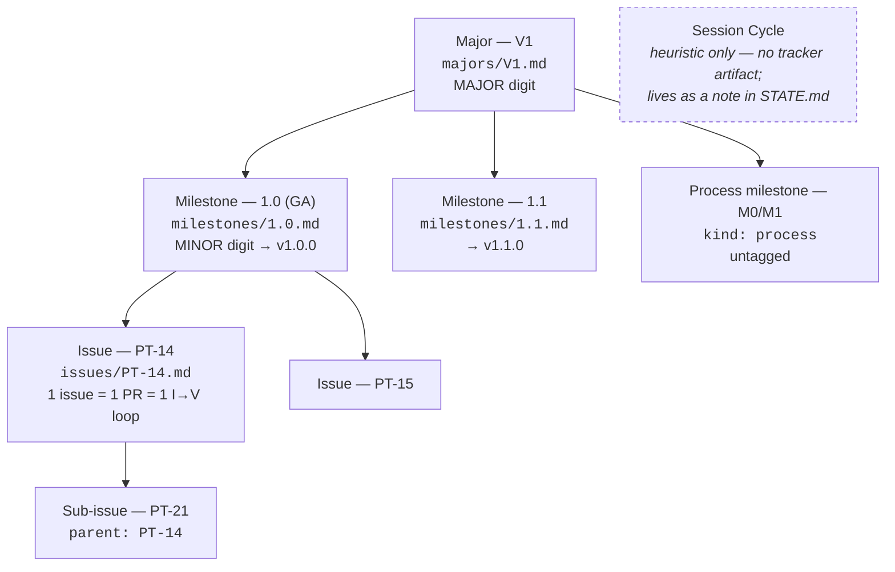

# Cairn — the file-based issue tracker

> Design spec for the template's project-management backend. Replaces Linear as the default.
> Status: **design, not built — all design questions ruled 2026-08-19** (see [Resolutions log](#resolutions-log)).
> Stage 2 of four: (1) decide — see the 2026-08-19 entry in [`TEMPLATE_DECISIONS.md`](TEMPLATE_DECISIONS.md); (2) **this spec**; (3) engine; (4) skills migration + dogfood.

## Purpose

Linear works, but its free tier imposes limits the template cannot design around: a **250 active-issue cap** across the workspace, a **1-month minimum auto-archive**, **one user** (so nine agents share a single identity), and an **MCP server verbose enough that we shipped a firewall agent** (`mcp-broker`) to keep its payloads out of the team-lead's context. Three of the template's moving parts — `process/BACKLOG.md`, `/sync-backlog`, `/cleanup-linear` — exist *only* to work around the cap and the archive policy. They are scar tissue.

What Linear got right and this design keeps: a **post-and-comment issue database**, a **major → milestone → issue → sub-issue hierarchy**, and **Kanban + list** visualisation.

**Cairn** is that, as files in git.

### Principles

1. **The files are the database.** One markdown file per issue, YAML frontmatter, comments appended to the body. Issue data lives in the project's own repo, next to the code it describes.
2. **Git is the engine.** History, blame, audit trail, undo, branching, and conflict detection all come free. There is no second store to keep in sync and nothing to back up.
3. **Agents never need a server.** The nine specialists and the team-lead interact with the tracker via `Read` / `Write` / `Edit` / `Grep` and one thin local CLI. **Zero MCP, zero HTTP, zero JSON payloads in context.** This is the core design goal — it *deletes* the Linear-MCP context-bloat problem rather than firewalling it.
4. **The server is a lens, not a source of truth.** A small stateless local server parses the issues directory **at request time** and renders a board. It holds no state, has no build step, and runs only while a human is looking. Killing it loses nothing.
5. **No caps, no expiry.** Archiving is moving a file to `archive/`. It is hygiene, never a quota.
6. **Boring stack.** Python 3 stdlib + a static page. Nothing to install on macOS.

### Non-goals

- **Not a backend abstraction.** Cairn is *the* backend. There is no pluggable-provider layer and no dual-write to Linear.
- **Not multi-user or networked.** Binds `127.0.0.1`. Collaboration is git.
- **Not cross-project.** Cairn is per-repo by construction, so Linear's one-board-across-every-project view has no equivalent. **Ruled 2026-08-19: accepted as a v1 regression.** A multi-root mode (`cairn serve --repos ~/Projects/*`) is recorded as a possible phase 3 and is explicitly **not committed** — build it only if the missing cross-project view actually bites.
- **Not a Session-Cycle tracker.** Session Cycles are a session-planning heuristic with deliberately no tracker artifact — the same call the [2026-07-23 version-hierarchy decision](TEMPLATE_DECISIONS.md) made when it dropped the Linear Cycle. Nothing here re-opens it.

---

## Name

Three candidates were considered:

| Candidate | For | Against |
|---|---|---|
| **`cairn`** ✅ | Unique token — `grep -rn cairn` never collides with prose. Short (5 chars), clean as a directory, CLI, ID prefix, and future repo name. The metaphor is honest: durable stone markers left along a path, needing no attendant. | Requires one sentence of explanation on first encounter. |
| `tracker` | Zero cleverness, zero ambiguity. | The docs use "track", "tracking", "tracker" as ordinary English constantly. Every grep is polluted; every sentence needs disambiguation. Fatal for a name that agents will search on. |
| `slate` | Nice board metaphor. | Collides with Slate.js and several other tools; muddies search results outside the repo too. |

**Recommendation: `cairn`.** Write it as "cairn (the file-based issue tracker)" on first mention in any doc. The name is load-bearing precisely because agents locate things by grep.

---

## Data model

### Directory layout

```
process/cairn/
├── config.yml            engine + project config (committed — no secrets)
├── majors/
│   └── V1.md             major version line  (was: Linear Initiative)
├── milestones/
│   ├── M0.md             process milestone   (was: Linear Project)
│   ├── M1.md
│   └── 1.0.md            product milestone, named by target version
├── issues/
│   ├── PT-1.md           feature            (was: Linear Issue)
│   └── PT-2.md
└── archive/
    └── PT-1.md           same schema; moved here as hygiene

scripts/cairn/            THE ENGINE — self-contained, spin-off-ready
├── cairn                 bash shim → cairn.py
├── cairn.py              CLI + parser + server (stdlib only)
└── board/
    ├── board.html
    ├── board.js
    └── board.css
```

**Data under `process/`** because it *is* process state — sibling to `STATE.md`, `DECISIONS.md`, `BACKLOG.md`. Cohesion beats a shorter path; `process/cairn/` is still a distinctive grep root.

**The layout is fixed at `process/cairn/` in v1.** An earlier draft offered a `data_dir` key in `config.yml` for projects preferring a top-level `cairn/`; it is removed, because the key is circular — `config.yml` lives *inside* the directory it would declare, so the engine must already have found the directory before it can read where the directory is. Relocation, if it is ever wanted, belongs to an env var or a flag, not to the config file.

**A missing or config-less data dir is an error, never an empty result.** If the engine cannot resolve a directory containing `config.yml`, it says so and exits non-zero — it does not report zero issues. "No tracker here" and "no issues here" are different facts and must never render identically.

**Engine under `scripts/cairn/`** and nowhere else. It touches no project file outside `process/cairn/`, so `git subtree split --prefix=scripts/cairn` extracts it cleanly if `/spin-off-component` is ever warranted. Keeping data and engine in separate trees is what makes that split trivial — a combined `cairn/` would drag every project's issue history into the extracted repo.

### `config.yml`

```yaml
prefix: PT              # issue ID prefix; derived from the repo name at setup,
                        # confirmed or overridden by the user once (see /setup-tracker)
port: 8766              # board server port
board:
  columns: [backlog, todo, in-progress, in-review, done]
  swimlane: milestone   # milestone | none
```

Status vocabulary is deliberately **not** configurable in v1 — the skills hard-code the transitions, and a per-project vocabulary would fork them.

### Issue file — complete example

`process/cairn/issues/PT-14.md`:

```markdown
---
id: PT-14
title: Google OAuth login
status: in-progress
milestone: "1.0"
parent: null
assignee: backend-lead
labels: [auth, api]
priority: P1
pr: null
created: 2026-08-14
updated: 2026-08-19
---

A returning user should be able to sign in with their Google account instead of
a password, so first-run friction drops and we stop storing credentials.

## Acceptance criteria

- [ ] `GET /auth/google` redirects to Google's consent screen with the correct scopes
- [ ] Callback exchanges the code and creates or links a local user record
- [ ] An existing email-password user signing in via Google is linked, not duplicated
- [ ] Failure path renders a recoverable error, never a stack trace

## Comments

### @qa-engineer — 2026-08-18

Failing acceptance test committed: `tests/auth/test_google.py::test_consent_redirect`.
Note the linking case needs a fixture with a pre-existing email user — added one.

### @architect — 2026-08-19

Reuse `lib/session/store.py` rather than introducing a second session abstraction.
The OAuth path should end in the same session object the password path produces.
```

### Frontmatter schema

| Field | Type | Required | Notes |
|---|---|---|---|
| `id` | string | ✅ | Must equal the filename stem. **The filename is authoritative**; `cairn check` errors on a mismatch. Kept in-file so a pasted or moved file is self-describing. |
| `title` | string | ✅ | One line. No trailing period. |
| `status` | enum | ✅ | See [Status vocabulary](#status-vocabulary). |
| `milestone` | string \| null | ✅ | Milestone slug (`"1.0"`, `M0`). Quote numeric-looking values. `null` = unassigned. |
| `parent` | id \| null | ✅ | Sub-issue linkage. One level is expected; the parser tolerates deeper nesting but the board renders two. |
| `assignee` | string \| null | ✅ | Bare agent role (`backend-lead`) matching a file in `.claude/agents/`, or `@handle` for a human. Replaces Linear's `agent:<role>` labels — attribution becomes a field, not a label. |
| `labels` | list[string] | ✅ | Free-form, lowercase-kebab. May be `[]`. |
| `priority` | `P0`–`P3` \| null | — | Backlog ordering only. Not a due date. |
| `pr` | url \| null | — | Written by `/finish-feature`. Lets the board link out. |
| `created` | date | ✅ | `YYYY-MM-DD`. |
| `updated` | date | ✅ | `YYYY-MM-DD`. |

**Dates are date-only, everywhere.** Precise timestamps are git's job — `git log --follow process/cairn/issues/PT-14.md` gives the exact history with authorship. Storing a second, hand-maintained clock invites drift and format bikeshedding for no gain. `updated` earns its place only because `git checkout` resets file mtimes, so mtime can't order issues across clones.

**Rejected fields, with reasons:**
- `estimate` — the workflow never uses one. `/drive` doesn't read it; cycle time is derivable from git. It would be a field nobody maintains.
- `branch` — derivable by convention (`feature/pt-14-<slug>`).
- `major` on issues — derivable via `milestone` → milestone file → `major`. Two sources would drift.

### Milestone file

`process/cairn/milestones/1.0.md`:

```markdown
---
id: "1.0"
name: MVP
kind: product          # product | process
major: V1
status: planned        # planned | in-progress | paused | completed | cancelled
target_tag: v1.0.0
ga: true               # exactly one product milestone per major carries ga: true
---

**Definition of done:** a new user can sign up, log in, and complete the core loop
end to end on staging, with the acceptance suite green.
```

Process milestones (`M0 — Bootstrap & Research`, `M1 — Plan`) use `kind: process`, `target_tag: null`, `ga: false`.

### Major file

`process/cairn/majors/V1.md`:

```markdown
---
id: V1
status: active         # planned | active | completed
owner: mosko
target_ship: null
health: on-track       # on-track | at-risk | off-track
---

Founding major line. Starts at MAJOR 0; `1.0` is the GA-designated milestone.
```

These two file types carry exactly the columns that `STATE.md` → *Roadmap* and *Major line / Initiative* carry today. See [Relationship to STATE.md](#relationship-to-statemd).

### Status vocabulary

Identical to the Linear statuses the skills and `STATE.md` already name, so migration is mechanical and no skill has to learn a new word.

| Slug | Meaning | Kanban column |
|---|---|---|
| `backlog` | Scoped, not queued | 1 |
| `todo` | Queued for this milestone | 2 |
| `in-progress` | A feature branch is open (`/start-feature` sets it) | 3 |
| `in-review` | PR open, awaiting QA + merge (`/finish-feature` sets it) | 4 |
| `done` | Merged (`/merge-pr` sets it) | 5 |
| `cancelled` | Dropped | hidden behind a filter |

`cancelled` gets no column: a dead card sitting in a live column is noise, and the count it inflates is the one people read.

### Comment format

Comments append to the end of the file, under a single `## Comments` heading, oldest first:

```markdown
## Comments

### @qa-engineer — 2026-08-18

Body. Any markdown, including code fences and `### headings that are not delimiters`.

### @architect — 2026-08-19

Second comment.
```

**Parser rule:** everything after the first line matching `^## Comments\s*$` is the comment log. A new comment starts at a line matching **exactly** `^### @([a-z0-9][a-z0-9-]*) — (\d{4}-\d{2}-\d{2})\s*$`; its body runs to the next such line or EOF. Any other `###` line is body content. The em dash is required — it is what makes the delimiter unambiguous against ordinary headings.

**Author vocabulary:** an agent role (`@backend-lead`, `@qa-engineer`, …), a human handle (`@mosko`), or `@board` for a comment authored from the board UI by a human who didn't set a handle.

This shape was chosen so an agent can append a comment with a **plain `Edit`** — the anchor is the last line of the file, no structure to reconstruct — while a regex splits the log reliably.

### Sub-issues

A sub-issue is an ordinary issue file with `parent: PT-14`. It has its own status and can be assigned independently. The board renders a `2/3` badge on the parent and nests children in the detail drawer. There is no separate file type and no ordering field — children sort by ID.

### Archive

`process/cairn/archive/` holds the same files, moved. The board reads `issues/` only. Archiving is invoked explicitly:

```
scripts/cairn/cairn archive --done-before 2026-06-01
```

It exists so a three-year-old project doesn't parse 1,400 files per request and so the board stays readable — **not** because anything expires. Archived issues remain in git, remain greppable, and can be moved back with `git mv`.

---

## ID scheme and collision-free allocation

**Format:** `<PREFIX>-<n>` — `PT-14`. Prefix from `config.yml`; `n` a plain incrementing integer. **Ruled 2026-08-19:** `/setup-tracker` derives the prefix from the repo name (`project_template` → `PT`) and asks the user to confirm or override it — once, at setup, never again. Two projects sharing a prefix is harmless (IDs never leave their repo) but confusing when pasting between sessions, and one prompt is cheaper than the confusion. Readable in branch names (`feature/pt-14-google-oauth`), commit subjects (`feat(PT-14): …`), and conversation. No ULIDs, no hashes — an ID a human has to read aloud is worth the allocation work.

**The race:** `max(existing) + 1` computed by directory scan is not atomic. Two agents scanning concurrently both see `14` and both write `PT-15.md`; one silently clobbers the other.

**The fix, in two layers:**

1. **Within a worktree — atomic claim.** `cairn new` computes `max + 1` over `issues/` **and** `archive/` (archived IDs are never reused), then creates the file with `O_CREAT|O_EXCL`. If the file already exists, it increments and retries, up to 50 times. `O_EXCL` is atomic on every filesystem the template targets, so the loser of a race gets `PT-16` rather than a lost write. This is the one operation that genuinely cannot be done safely with a plain `Write`, which is the main reason the CLI exists.

2. **Across branches — git is the detector.** Two branches that each allocate `PT-15` produce an **add/add conflict** at merge. Git refuses to merge silently; resolution is `git mv` on one file plus a one-line `id:` edit, because the file is self-describing and nothing else references the ID except the branch name and commit trailers. Loud beats silent.

**Rejected: a counter file** (`process/cairn/.counter`). It's a second source of truth, it conflicts on *every* concurrent branch instead of only on genuine ID collisions, and it can drift from the directory it claims to describe. Deriving `max` from the directory means the directory is always right.

**Practical exposure is low:** issues are created in bulk at planning time (on one `phase/*` branch) and merely *consumed* during Implement, and the template's discipline is one feature branch at a time. Cross-branch allocation is the exception, and it fails loudly when it happens.

**Ruled 2026-08-19: the add/add conflict stays the detector.** The alternative — having `/start-feature` reserve an ID on `main` before branching — trades a rare, loud, cheaply-resolved conflict for an extra commit on `main` per feature, every feature, forever. Not worth it.

---

## Hierarchy mapping

Cairn represents the [version-driven hierarchy](WORKFLOW.md#versioning-scheme) ratified on 2026-07-23 natively — one file type per durable layer, nothing for the heuristic one.



| Concept | Cairn artifact | Version digit |
|---|---|---|
| Major version line (`V1`, `V2`, concurrent) | `majors/<id>.md` | **MAJOR** |
| Milestone (product, named by target version) | `milestones/<version>.md`, `kind: product` | **MINOR** |
| Milestone (process: Bootstrap & Research, Plan) | `milestones/<Mn>.md`, `kind: process` | — (untagged) |
| Feature | `issues/<ID>.md` | — (identity = ID + PR + release notes) |
| Sub-issue | `issues/<ID>.md` with `parent:` | — |
| Hotfix | `issues/<ID>.md` on the milestone it patches | **PATCH** |
| Session Cycle | **none, by design** | — |

Concurrent majors fall out for free: `majors/V1.md` and `majors/V2.md` both `status: active`, each with its own milestones, in one repo, on one board with a major selector.

---

## Relationship to `STATE.md`

This is the one place cairn overlaps an existing artifact. **Ruled 2026-08-19: the overlap dissolves.**

`STATE.md` currently hand-maintains four tables that cairn represents natively — **Major line / Initiative**, **Roadmap**, and **Features → Completed / In Flight / Backlog** (the names as they stand in that file today). It also holds four things cairn deliberately does *not* model: **Current Phase**, **Active Feature**, **Session Cycles**, and **Releases**.

**In stage 3, the four overlapping tables are removed from `STATE.md`.** It keeps what it uniquely holds — Current Phase, Active Feature, Session Cycles, Releases — plus a pointer to the board and, optionally, a generated snapshot appended at milestone close:

```
scripts/cairn/cairn snapshot >> process/STATE.md
```

The snapshot exists for offline reading (a plane, a phone, a cold session before the board is up); it is a rendering, never an input.

Two consequences:

- **The [Completed-table rolloff](WORKFLOW.md) ritual retires.** Its entire purpose was bounding a hand-maintained duplicate so a full read of `STATE.md` stayed cheap on resume. With the duplicate gone, there is nothing to roll off.
- **`STATE.md` shrinks to the live-state ledger it was always described as** — phase, active feature, session rhythm, shipped versions. Durable work state moves to `process/cairn/`.

---

## Engine

### Stack

**Python 3 standard library, no dependencies, no build step.** Same choice as `scripts/serve-docs.py`, for the same reason: macOS ships `python3`, the template's audience already runs `serve-docs.sh`, and a second toolchain would be a second thing to install before the board renders.

- **YAML:** a ~60-line strict-subset parser inside `cairn.py`. It handles what the schema uses — scalars, quoted strings, `null`, flow lists (`[a, b]`), block lists — and **errors loudly** on anything else. PyYAML is not imported, not even optionally: an "import it if present, else fall back" path means two parse behaviours and a bug that only reproduces on one machine. One parser, one behaviour, a documented subset, and `cairn check` to enforce it.
- **Frontend:** one `board.html` + vanilla `board.js` + `board.css`. No framework, no bundler, no CDN — the board works offline, matching the template's existing `vendor-mermaid.sh` precedent.

*Alternatives considered:* **Node** (not guaranteed present on macOS; adds a runtime the template otherwise doesn't need), **Go** (fast and single-binary, but needs a toolchain and a build step, which contradicts "no build step" and makes the in-template copy a binary artifact), **Deno/Bun** (install required). Python's only real cost is startup latency on a local board nobody is benchmarking.

### Lifecycle

```
/cairn                    # skill: backgrounds the server under the Claude session,
                          # cleaned up on /exit; probes for a running instance first
scripts/cairn/cairn serve # direct invocation, foreground, request logs
CAIRN_PORT=8899 … serve   # port override
```

**Session-bound by default** (mirrors `/serve-docs`), **persistent-capable** by running the direct invocation in your own terminal or under `launchd`. Because the server holds no state, the two modes are indistinguishable to the data.

### Coexistence with `serve-docs`

**Separate server, separate port** — docs on `8765`, cairn on `8766`. They are unrelated features with different lifecycles and different roots, and merging them would couple the docs review loop to the tracker and drag `docs/` into any future cairn spin-off. The cost is that a human reviewing docs *and* the board runs two processes; the mitigation is that both are one-line skills (`/serve-docs`, `/cairn`) and the board header links to `:8765` when it responds.

### API surface

Four endpoints. All bind `127.0.0.1`, no auth — same posture as `serve-docs.py`.

| Method | Path | Purpose |
|---|---|---|
| `GET` | `/api/board` | Full parsed state: majors, milestones, all non-archived issues (without comment bodies). Supports `ETag`/`If-None-Match`. |
| `GET` | `/api/issue/<id>` | One issue: frontmatter, description, acceptance criteria, full comment list, `seen` token. |
| `POST` | `/api/issue` | Create. Body `{title, …}`. Allocates an ID via the same `O_EXCL` path as `cairn new`. |
| `POST` | `/api/issue/<id>` | Mutate. Body `{seen, patch?, comment?}`. Handles the drag-to-column case (`patch: {status: …}`), inline field edits, and comment append through one code path. |

Plus static routes: `/` (Kanban), `/list` (list view), `/board/*` (assets).

There is deliberately **no** dedicated status endpoint — a drag is just a patch, and a second write path is a second place for the frontmatter rewriter to be subtly different.

#### Example exchange — drag a card from *In Progress* to *In Review*

```
POST /api/issue/PT-14
Content-Type: application/json

{"seen": "1755600123456789", "patch": {"status": "in-review"}}
```

```
200 OK
{"id":"PT-14","status":"in-review","updated":"2026-08-19","seen":"1755600987654321"}
```

Stale-card case — the `current` object below is **illustrative, not a schema**. Any response that carries at least the issue's current field values and a fresh `seen` is conformant; returning the full issue payload (description and comments included) is a superset and is preferred, since it lets the drawer re-render from the same response.

```
409 Conflict
{"error":"stale","message":"PT-14 changed on disk since you loaded it",
 "current":{"id":"PT-14","status":"done","assignee":"backend-lead","updated":"2026-08-19",
            "seen":"1755600555000000"}}
```

The board snaps the card back, applies `current`, and flashes *"PT-14 changed on disk — refreshed."*

#### Example exchange — add a comment

```
POST /api/issue/PT-14
{"seen":"1755600987654321","comment":{"author":"mosko","body":"Ship it behind a flag."}}
```

appends to the file:

```markdown

### @mosko — 2026-08-19

Ship it behind a flag.
```

### Write-back and conflict handling

Board edits **rewrite only the frontmatter block**, re-emitted in canonical key order; the body after the closing `---` is concatenated **byte-for-byte** from the original. Comment appends touch only the tail. Writes go to a temp file in the same directory followed by `os.replace` — atomic, so a crashed write can't truncate an issue.

**`seen` is `st_mtime_ns` as a string.** The browser receives it with every read and returns it with every write; the server compares against the file's current mtime and returns `409` on mismatch.

The ratified decision allows last-write-wins and makes the mtime check optional. **This spec ships the check in phase 1** — it's roughly ten lines, and the collision it prevents is the one this architecture actively creates: an agent edits `PT-14` while a board tab from twenty minutes ago still shows the old card, and a single drag silently reverts the agent's work. Last-write-wins is fine between two humans who can see each other; it is not fine between a human and a background agent.

**No auto-commit.** Board edits dirty the working tree exactly as an agent's edits do, and they are committed by the same session/feature-close discipline. A tracker that commits on its own would interleave commits into whatever branch happens to be checked out.

### CLI

`scripts/cairn/cairn` — the only non-file interface, and it exists for two jobs a plain `Edit` cannot do safely:

| Command | Why it isn't just an Edit |
|---|---|
| `cairn new "<title>" [--milestone 1.0 --assignee backend-lead --status backlog --parent PT-14]` | Atomic `O_EXCL` ID allocation. |
| `cairn ls [--status todo --milestone 1.0 --assignee qa-engineer]` | One line per issue instead of reading N files into context. Context economy is the whole point. |
| `cairn set PT-14 status=in-review pr=<url>` | Frontmatter-only rewrite that can't corrupt the body. |
| `cairn comment PT-14 --author qa-engineer --body -` | Correct delimiter + date, from stdin. |
| `cairn show PT-14` | Rendered single issue. |
| `cairn archive --done-before <date>` | Bulk `git mv`. |
| `cairn check` | Lint: id/filename mismatch, dangling `parent`, unknown `milestone`, bad `status`, unsupported YAML. |
| `cairn serve` | The board. |

**Ruled 2026-08-19: the CLI is legitimate under "agents never need a server."** The constraint is read as *no MCP, no HTTP, no JSON payloads in context*; a local script that prints one line satisfies it, and atomic ID allocation cannot be done safely any other way.

**Every one of these has a documented hand-edit equivalent, and hand-editing stays fully supported** — the files are the interface; the CLI is a convenience. But agents should prefer `cairn ls` over grepping a directory and `cairn new` over composing a file, because the first saves context and the second is the only allocation that is race-safe.

### Board — phase 1 scope

**Kanban view (`/`)**
- Five columns (`backlog` → `done`); `cancelled` behind a filter toggle.
- **Card:** ID · title · assignee chip · label chips · milestone chip · `2/3` sub-issue badge (or a parent badge on a child).
- **Swimlanes by milestone**, toggleable to flat. One swimlane dimension only in phase 1 — assignee/label swimlanes are a filter away and don't earn a second layout mode.
- **Header:** major tabs (concurrent majors are first-class), then per-milestone progress — `1.0 · GA · v1.0.0 · 7/12 done`.
- **Filters** (client-side over the one `/api/board` payload): milestone, assignee, label, major, free-text. Keeping filtering in the browser is what keeps the API at one read endpoint.
- **Drag** a card between columns → `POST /api/issue/<id>`.

**List view (`/list`)**
- Same data, same filters, sortable table (ID, title, status, milestone, assignee, priority, updated).
- **Read-only** in phase 1; click a row to open the detail drawer and edit there.

**Detail drawer** (both views)
- Description, acceptance-criteria checklist, comment log, add-comment box, inline editors for title / status / assignee / milestone / labels / priority, link to the PR and to the file path.
- **Markdown is *not* rendered in phase 1** — the description and comment bodies show as raw text in a `<pre>`. Python's stdlib has no markdown renderer, and vendoring a JS one (precedent: `vendor-mermaid.sh`) is real work for a cosmetic gain. **Ruled 2026-08-19:** ship `<pre>`; vendor a renderer only once it demonstrably annoys. The vendoring path stays the recorded answer for when it does.

**Liveness (phase 1):** `setInterval` poll of `/api/board` every 4s, plus an immediate refetch on `visibilitychange` and `focus`. `ETag` = a hash over `(path, mtime_ns)` for every file, so an unchanged board costs a `304` and no parse.

**Explicitly out of phase-1 scope:** markdown rendering in the drawer, issue creation from the board beyond title + milestone, drag-to-reorder, keyboard shortcuts, saved filter presets, charts of any kind.

---

## Phase 2 and beyond — deferred work

### Live push (SSE)

Designed now, built later. It shares **all** parsing, rendering, and write code with phase 1; only the transport changes.

- **New endpoint:** `GET /api/events` → `text/event-stream`.
- **Watcher:** a background thread `os.scandir`s the data dir every 500 ms and diffs `(path, mtime_ns)`. Not a kernel fs-watch — `kqueue`/`inotify` differ by platform and stdlib gives no portable wrapper. A stat-scan over a few hundred small files at 2 Hz is cheap and portable, and being honest about that is better than claiming a watch we don't have.
- **Events:** `{"type":"changed","ids":["PT-14"]}` / `{"type":"created", …}` / `{"type":"removed", …}`. The client refetches only the named issues.
- **Client:** swaps `setInterval` for `EventSource`, and **falls back to polling automatically** if `/api/events` 404s or the stream drops — so a phase-1 server and a phase-2 board stay compatible in both directions.

Ship it when the 4-second poll visibly lags during a live pairing session. Not before.

### Candidate follow-ups (designed for, not committed)

| Candidate | Status | Note |
|---|---|---|
| **Acceptance-criteria checkbox write-back** — board renders live checkboxes that rewrite `- [ ]` → `- [x]` | **Deferred (ruled 2026-08-19)** | Phase 1 keeps **zero body-touching write paths** — the sole exception is comment append, which is tail-only and cannot disturb what precedes it. Checkbox write-back would be the first path that rewrites the *middle* of a file, which is exactly what the byte-preserving guarantee in [Write-back](#write-back-and-conflict-handling) exists to avoid. If ever built, it needs its own anchored-rewrite design and its own conflict story. |
| **Multi-root board** — `cairn serve --repos ~/Projects/*` | **Possible phase 3, not committed** | Restores Linear's cross-project view, accepted as a v1 regression (see [Non-goals](#non-goals)). Build only if the absence actually bites. |
| **Markdown rendering in the drawer** — vendored JS renderer | **Deferred (ruled 2026-08-19)** | `<pre>` ships in phase 1; vendor along the `vendor-mermaid.sh` path only when it demonstrably annoys. |

---

## Skills migration outline

Stage 3 preview. Linear skills stay in place for **one release**, marked deprecated, then are removed.

| Skill / file | Change |
|---|---|
| `/setup-linear-team` | → **`/setup-tracker`**. Scaffolds `process/cairn/`, writes `config.yml` — **deriving the ID prefix from the repo name and asking the user to confirm or override it once** — then seeds `majors/V1.md` + `milestones/M0.md` + `milestones/M1.md` and sets delivery autonomy. **No MCP, no network, no team resolution, no label seeding** — the nine `agent:<role>` labels become the `assignee` field. Roughly a third the length. |
| `/start-feature` | Resolve the issue with `cairn ls` / `cairn show` instead of `list_issues`/`get_issue`. **Delete step 1a (backlog promotion) and step 2 (budget check) entirely** — both existed only for the 250 cap. `cairn set <id> status=in-progress` + `cairn comment`. Anchor-task and team-spawn steps unchanged. |
| `/finish-feature` | `cairn set <id> status=in-review pr=<url>`; comment with the PR link. |
| `/merge-pr` | `cairn set <id> status=done`; merge comment. The Linear-archive step becomes an optional `cairn archive` at milestone close. Release-tagging logic unchanged. |
| `/drive` | Re-point work resolution to cairn (`cairn ls --status todo --milestone <m>`). Goal-condition strings unchanged. |
| `/sync-backlog` | **Retire.** Its reason to exist was the cap. `/setup-tracker` step 5 converts existing `process/BACKLOG.md` rows into `status: backlog` issues via `cairn new` (ruled during stage 3: a one-shot engine subcommand wasn't worth the permanent surface). |
| `/cleanup-linear` | **Retire.** Replaced by `cairn archive`, reframed as hygiene rather than quota relief. |
| `process/BACKLOG.md` | **Dissolves into the tracker** as `status: backlog`, ordered by `priority` then ID. Kept one release as a deprecated stub pointing at the board. Jotting a rough item is `cairn new "…" --status backlog` — cheaper than editing a markdown table. |
| `.claude/linear-team.json` | → `process/cairn/config.yml`, and **committed** rather than gitignored: it holds no credentials, and every clone should agree on the ID prefix. |
| `mcp-broker` | Scope reduced — Linear drops off its server list; Drive/Gmail/Calendar/Spotify remain. It still earns its keep, but the traffic that motivated it is gone. |
| `/serve-docs`, `/refine-doc`, `/export-doc`, `/open-doc` | Unchanged. New sibling skill **`/cairn`** backgrounds the board server. |
| `WORKFLOW.md` | *Version control & Linear* → *Version control & the tracker*; the Team-coordination table's "Linear" row becomes "cairn (files in git)"; the free-tier-cap subsection and its ASCII overflow diagram are deleted; MCP-broker section loses its Linear emphasis. |
| `CLAUDE.md` | Artifacts table gains cairn; the first-run checklist swaps `/setup-linear-team` → `/setup-tracker`; the "Linear binding" bullet points at `config.yml`. |
| `STATE.md` | **Four tables removed** — *Major line / Initiative*, *Roadmap*, and *Features → Completed / In Flight / Backlog* — since cairn represents all of them natively. Keeps *Current Phase*, *Active Feature*, *Session Cycles*, *Releases*, plus a pointer to the board and an optional `cairn snapshot` appended at milestone close. See [Relationship to STATE.md](#relationship-to-statemd). |
| `WORKFLOW.md` → Completed-table rolloff | **Section deleted.** It existed only to bound the hand-maintained duplicate that is now gone. |
| Agent briefs (`.claude/agents/*.md`) | The **MCP routing** block in each shrinks; a one-line "the tracker is files under `process/cairn/` — read them directly" replaces the Linear-via-broker guidance. |

Branch naming (`feature/pt-14-<slug>`), commit trailers (`feat(PT-14): …`), and the PR flow are unaffected.

---

## Resolutions log

Every question this spec opened has been ruled. Each resolution is folded into the body section it governs; this log is the index, not a second source of truth.

| # | Question | Ruling (2026-08-19) | Where it lives |
|---|---|---|---|
| 1 | Does `STATE.md` keep its *Major line*, *Roadmap*, and *Features* tables, or do they dissolve into cairn? | **Dissolve.** Stage 3 removes all four overlapping tables; `STATE.md` keeps Current Phase, Active Feature, Session Cycles, Releases, plus a board pointer and an optional `cairn snapshot`. The Completed-table rolloff ritual retires with them. | [Relationship to `STATE.md`](#relationship-to-statemd) · [Skills migration](#skills-migration-outline) |
| 2 | Is losing Linear's cross-project board acceptable at v1? | **Accepted as a v1 regression.** Multi-root (`cairn serve --repos …`) is recorded as a possible phase 3, explicitly not committed. | [Non-goals](#non-goals) · [Candidate follow-ups](#candidate-follow-ups-designed-for-not-committed) |
| 3 | How is the ID prefix chosen? | **Repo-derived default with a one-time confirm prompt** at `/setup-tracker`. | [ID scheme](#id-scheme-and-collision-free-allocation) · [`config.yml`](#configyml) |
| 4 | Render markdown in the detail drawer, or ship `<pre>`? | **`<pre>` ships in phase 1.** Vendoring a JS renderer (the `vendor-mermaid.sh` path) is deferred until it demonstrably annoys. | [Board — phase 1 scope](#board--phase-1-scope) |
| 5 | Should `/start-feature` reserve IDs on `main` to avoid cross-branch collisions? | **No — the git add/add conflict stays the detector.** A rare loud conflict beats an extra `main` commit per feature, forever. | [ID scheme](#id-scheme-and-collision-free-allocation) |
| 6 | Does the CLI violate "agents never need a server"? | **No — the CLI stands as specified.** The constraint reads as no-MCP / no-HTTP / no-JSON-in-context, which a one-line-printing local script satisfies. | [CLI](#cli) |
| 7 | Should the board write back acceptance-criteria checkboxes? | **Deferred.** Phase 1 keeps zero body-touching write paths (comment append excepted — tail-only). If ever built, it would be the first middle-of-file rewrite and needs its own design. | [Candidate follow-ups](#candidate-follow-ups-designed-for-not-committed) |
| 8 | Should `config.yml` carry a `data_dir` key so a project can relocate the tracker to a top-level `cairn/`? | **No — affordance removed (2026-08-20, during stage-2 conformance review).** The key is circular: `config.yml` lives inside the directory it would declare. v1 fixes the layout at `process/cairn/`, and a **loud-error contract** replaces it — an unresolvable data dir is an error, never an empty result. | [Directory layout](#directory-layout) · [`config.yml`](#configyml) |

Rows 1–7 were ruled 2026-08-19 at design time; row 8 was ruled 2026-08-20, when building the engine surfaced a question the spec had answered wrongly. Nothing in this spec is pending a decision.
