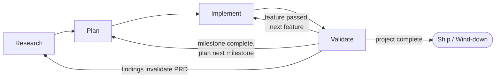

# Workflow

> The "how" of running this project. Phases, roles, artifacts, gates.

## Phase model

Every project moves through four phases. **Implement and Validate are nested loops at three scales** — from innermost to outermost: **feature → milestone → major line**. The same I↔V mechanics repeat at each scale; only the size of the deliverable changes. (**Session Cycles** are a **context-bounded working rhythm** — the AI-native replacement for a sprint. They group the features + directives you plan to attempt in one Claude session before context bloats past ~80%. They're a heuristic planning wrapper, not a loop scale and **not** a tracker artifact: session boundaries are bookkeeping events, not I↔V gates. See [Session Cycles](#session-cycles).)



| Phase | Driver agent | Output artifact | Gate to next phase |
|---|---|---|---|
| **Research** | product-manager | `docs/PRD/index.html` (v1) | PRD covers Problem, Goals, Users, Stories, Non-Goals; user approves |
| **Plan** | architect | `docs/ARCH/index.html` + `docs/SECURITY/index.html` | ARCH covers stack, components, data flow, CI/CD; SECURITY covers threat model + controls |
| **Implement** | implementation leads (per project config — see below) | Working code on a feature branch | All tests green; code reviewed by peer agent |
| **Validate** | qa-engineer | Test results + release notes | Acceptance criteria met; SECURITY checks pass; PR merged |

A phase gate is a **human decision**, not an automated check. The lead summarizes gate evidence; the user approves the transition. Approval gets logged in [`DECISIONS.md`](DECISIONS.md).

## Project configuration

Specialist roles (PM, UX, Architect, SecEng, QA, DevOps) apply universally. The **implementation lead(s)** are tuned per project:

| Project shape | Active implementation lead(s) |
|---|---|
| Full-stack web/mobile app | `frontend-lead`, `backend-lead` |
| API or backend service only | `backend-lead` |
| Frontend-only / static site | `frontend-lead` |
| CLI, library, plugin, ML/data pipeline, single-binary service | `implementation-lead` (generalist) |
| Hybrid (e.g. CLI + web admin) | mix as appropriate |

**This project uses:** _e.g. `frontend-lead`, `backend-lead`_ — _set during Plan phase, log change as a `DECISIONS.md` entry if it shifts later._

All implementation-lead agent files ship with the template; the project just picks which are active. Inactive ones can be left in place — they cost nothing until spawned.

### Delivery autonomy

How far a `/drive`-aimed [goal-driven loop](#goal-driven-loop-drive) runs before handing control back to you. Set once at `/setup-tracker`; change by editing the line below and logging a `DECISIONS.md` entry.

**Delivery autonomy:** _`stop-at-merge` (default) | `self-merge-within-milestone`_ — _set at bootstrap; see [Goal-driven loop](#goal-driven-loop-drive)._

## Phase-by-phase

### Research

**Goal:** Decide *what* we're building and *for whom*.

- **Driver:** `product-manager`
- **Active team:** product-manager (driver), ux-designer (late in phase), seceng (consult, high-level only)
- **Activities:**
  - PM interviews the user via the `/generate-prd` skill (chatprd.ai-grounded template)
  - PM drafts user stories, success metrics, non-goals
  - UX produces flows + wireframes in `docs/DESIGN/` via `/generate-designdoc` (late-phase, after stories stabilize) — the design system (`tokens.css`/`screen.css`) matures later, through Plan and Implement
  - SecEng surfaces regulatory and high-level security considerations (e.g. "this handles PHI" → flag for SECURITY.md later)
- **Artifact:** `docs/PRD/index.html` (+ `docs/DESIGN/` flows & wireframes, late-phase)
- **Gate:** User approves PRD v1.

### Plan

**Goal:** Decide *how* we'll build, deploy, and secure it.

- **Driver:** `architect`
- **Active team:** architect (driver), seceng, devops-engineer, qa-engineer
- **Activities:**
  - Architect drafts `ARCH` (system context, components, data flow, tech stack, deployment topology) via `/generate-archdoc`
  - SecEng produces `SECURITY` via `/generate-secdoc` (threat model, trust boundaries, controls, compliance, incident response)
  - DevOps defines CI/CD topology, IaC approach, environments
  - QA proposes a test strategy (unit, integration, E2E split; coverage targets; acceptance-test framework)
  - Lead breaks the roadmap into **milestones (`process/cairn/milestones/`) → features (cairn issues)**; Session Cycles are a session-time planning heuristic, not a roadmap layer
  - Architect **designates the GA milestone** for the major line — the one that tags `N.0.0` — and sets each development milestone file's `target_tag` (see [Versioning scheme](#versioning-scheme))
- **Artifacts:** `docs/ARCH/index.html`, `docs/SECURITY/index.html`, populated `process/cairn/` (milestones + issues), updated `STATE.md`
- **Gate:** ARCH + SECURITY approved; tracker issues populated for the first milestone.

### Implement

**Goal:** Build the smallest shippable slice. Repeat.

- **Driver:** the active implementation lead(s) for this project (see **Project configuration** above)
- **Active team:** the project's implementation leads + `qa-engineer` (TDD pair)
- **Inner loop (per feature):**
  1. `/start-feature <issue-id>` — creates branch, claims the cairn issue, posts plan
  2. QA writes failing tests against acceptance criteria
  3. Lead writes the implementation; tests go green
  4. Peer review: another implementation specialist reads the diff via `SendMessage`. **If only one implementation lead is active for this project, the `architect` reviews instead.**
  5. `/finish-feature` — commits, pushes, opens PR, flips the issue to in-review
- **Gate (per feature):** PR mergeable, tests green, peer review approved.

### Validate

**Goal:** Confirm the slice actually works for the user and is safe to ship.

- **Driver:** `qa-engineer`
- **Active team:** qa-engineer (driver), devops-engineer (release), architect (review)
- **Activities:**
  - QA runs full regression + acceptance suite
  - DevOps deploys to staging (or prod if release-ready)
  - Architect reviews for arch drift / debt accumulation
  - **Duplicated-inline-expression check** (standing review criterion): when a fix or extraction touches a logic-dense client file — `board.js` above all — grep for the *same* expression written in two places (a predicate, a key-derivation, a grouping block) and expect it to route through one shared function, not two hand-maintained copies. Rationale: the cairn board hit this **three times** (`isDraggable`, `issueMilestoneKey`, `byMilestone` grouping); two caused real shipped-to-review defects the identical way — a fix applied to one copy and not the other. It is far cheaper to catch by looking deliberately than by waiting for the next escape. Verify collapse *by absence* (grep for the old inline shape, expect zero hits outside the shared module), not by presence of the new helper. **At fix time specifically (the rule that would actually have caught all three): when fixing a bug in an inline expression, grep for that expression's shape elsewhere before considering the fix complete.** You cannot grep for a duplicate you do not yet know exists — so the check must happen at the moment of the fix, when the expression is already in front of you. Worked example: the PT-3 null-guard was fixed in `cardEl`, then the identical gap was found separately in `handleDrop` and `new-issue-milestone`; one grep of the shape at fix time would have surfaced all three in a single pass.
  - **Write-path drift check** (standing review criterion — adopted 2026-08-23 from the PT-45/PT-39 finding): whenever a change tightens `check_repo`'s accepted values (a new lint, a narrowed enum), grep the write paths — `.claude/skills/*.md` and `process/WORKFLOW.md` instructions that *write* those fields — for literals the new lint rejects, before the loop closes. Rationale: the linter was tightened twice (PT-28, PT-39) while the things that generate data for it were not; the first produced a Day-0 lint failure in every freshly bootstrapped repo (PT-45), the second was caught only by running this sweep. Docs that merely *describe* values are fine; instructions that *emit* them must agree with the lint.
  - SecEng re-engaged if any security control was touched
- **Gate:** Acceptance criteria met → `/merge-pr` → update `STATE.md`. **Tag a release only if this PR completes a release milestone** — the `/merge-pr` skill prompts; tagging is never automatic.

After a Validate cycle, we either return to Implement (next feature in this Session Cycle) or escalate to a new Research mini-loop (if findings invalidate the PRD).

## Goal-driven loop (`/drive`)

The Implement→Validate inner loop can be driven turn-by-turn (you prompt each step) or handed to a **goal-driven loop** that keeps working until a completion condition is met. The engine is [`/goal`](https://code.claude.com/docs/en/goal.md) — a **native Claude Code command** (v2.1.139+), not something the template ships. After each turn, a fast evaluator (Haiku by default) checks the condition against what the session surfaced in the transcript; if unmet, the session continues automatically.

The `/drive` skill prepares a goal: it reads the methodology, resolves the next unit of work, runs pre-flight, and **constructs the `/goal …` line for you to paste.**

### Why you paste it (the human-paste constraint)

A skill **cannot self-issue `/goal`** — there is no model-callable goal tool and no `SlashCommand` tool; `/goal` is user-typed only. So `/drive` ends by surfacing the exact line. This is a feature, not a limitation: it puts a **human checkpoint at goal-set time**, consistent with "a phase gate is a human decision." You read and approve the condition before the loop runs. (Faking it via a settings Stop hook or a nested `claude -p "/goal …"` subprocess is unsupported — no mid-session hook hot-reload, and nested sessions contend over state. Don't.)

### The two methodologies

Chosen per project at `/setup-tracker`, stored in [Delivery autonomy](#delivery-autonomy) above. **`stop-at-merge` is the recommended default.**

| | **`stop-at-merge`** (default) | **`self-merge-within-milestone`** |
|---|---|---|
| Goal scope | one **feature** | one **milestone** |
| Loop runs | `/start-feature` → TDD → `/finish-feature` (opens PR) | for each issue: `/start-feature` → TDD → `/finish-feature` → `/merge-pr`, chained |
| Stops at | the **open, mergeable PR** — you review + `/merge-pr` | the **milestone boundary** (queue empty) |
| Human gate | preserved at every merge | delegated to the loop; gate moves to the milestone/phase boundary |
| Needs auto mode | no (a few turns, attended) | **yes** — unattended multi-feature run; otherwise every tool call prompts |
| Context | one feature per session | `/compact` between features to stay lean |

`stop-at-merge` keeps WORKFLOW's per-feature human gate intact and is the safe default. `self-merge-within-milestone` trades that gate for speed within a milestone — appropriate once a milestone's scope is well-understood and low-risk. Either way, **phase-gate transitions (R→P→I→V) remain human decisions** — no methodology auto-advances a phase.

`/goal` removes per-*turn* prompts; **auto mode** removes per-*tool* prompts. Self-merge needs both to run unattended.

## Session Cycles

A **Session Cycle** is this workflow's AI-native replacement for a sprint. A human sprint is bounded by *calendar* (1–2 weeks); a Session Cycle is bounded by *context budget* — one continuous Claude session, from a fresh start (or post-`/compact`) until context crosses ~80% or a natural boundary (feature merge, phase transition). It is the unit that actually governs throughput in an AI-driven project, because the real WIP limit here is the context window, not the calendar.

**Heuristic only — zero footprint anywhere.** A Session Cycle has no cairn artifact, by design (ruled in the 2026-07-23 version-hierarchy decision, carried forward into `process/TRACKER.md` → Non-goals), and since 2026-08-22 **no `STATE.md` record either** — the old Session Cycles history table was retired after growing to 65% of the auto-injected file, almost all of it duplicating cairn issues, the decision ledger, and the git log (see `TEMPLATE_DECISIONS.md`). A cycle's history *is* its artifacts: the issues it shipped (and their comments), the PRs, the commits. Plan a cycle, run it, and let those speak — any finding worth keeping goes to a cairn issue comment or the decision ledger at the moment it lands, not into a session narrative. Features still belong to **milestones** (`process/cairn/milestones/`) and **majors** (`process/cairn/majors/`) — those are the durable layers.

**The ritual: session planning at the start of each session.** Before doing tactical work, pick the small set of features + user directives you'll attempt this session — the set that plausibly fits under ~80% context. Defaults:

- **1 feature (one I→V loop) per session** is the baseline — it matches the "`/compact` at end of each I→V loop" rule in [CLAUDE.md](../CLAUDE.md) → Session management.
- Batch 2–3 issues into one session only if they're tightly related *and* the combined context stays under budget.
- **Directives count against the same budget.** A session heavy on ad-hoc reviews / doc tweaks fits fewer issues. Plan accordingly.

**Session planning is the review trigger.** At session-planning time, read the queue (`scripts/cairn/cairn ls --status todo`, falling back to `--status backlog`) and pick the session's set. There is no promotion tier — a scoped item is already an issue — and archiving (`cairn archive --done-before <date>`) is occasional hygiene at milestone close, never quota relief.

## Roles

### Principal (you)
- Sets vision, makes gate decisions, owns final approval.
- Authorizes the Agents (specialist teammates) to act on your behalf — hence "Principal" in the Principal/Agent sense.
- Asynchronous — picks up where STATE.md says we left off.

### Team Lead (the main Claude session)
- Coordinates phases, spawns/tears down teammate teams, owns `WORKFLOW.md` and `STATE.md`.
- **Delegate substantial domain work** to Agents via `SendMessage`; don't bypass them just to save a round-trip. (The lead still handles small operational tasks directly — running git commands, editing `STATE.md`, opening files for review, etc.)
- **Translates and summarizes for the Principal.** Agents communicate in their domain's idiom (architecture trade-offs, threat-model entries, test pyramids, deploy topologies). The lead distills their output into **executive summaries** — what changed, what it means, what decision the Principal needs to make next. If an agent's reply is dense or jargon-heavy, restate it in plain language before relaying it.

### Agents (`.claude/agents/*.md`)
- See `.claude/agents/` for the nine specialist definitions and their domains, plus the `mcp-broker` utility agent (see [MCP Broker](#mcp-broker)).
- Each runs in its own persistent context as a teammate (requires `CLAUDE_CODE_EXPERIMENTAL_AGENT_TEAMS=1`).
- Peers communicate via `SendMessage` without going through the lead.
- Authorized by the Principal; coordinated by the Team Lead.

## MCP Broker

Remote MCP servers — Google Drive, Gmail, Calendar, Spotify — return payloads that are enormous relative to the fact you actually need. A single `search_files` or `get_thread` can drop multiple kilobytes of JSON into whoever called it, and in the **team-lead's** window that context is paid for by the whole session, permanently. (The worst offender used to be Linear — the tracker is now **cairn**, local files with zero MCP surface, which deleted that traffic outright; the broker keeps earning its keep on the servers that remain.)

The `mcp-broker` teammate is the fix: a **context firewall**. It's the one agent that touches those servers, so the raw JSON lands in *its* isolated context and only a distilled answer — the fact plus the IDs needed to act — comes back over `SendMessage`. Delegate the query, get back three lines instead of five kilobytes.

**Default when the broker is on the team:** if `mcp-broker` has been spawned into the current team, route **all** ad-hoc `list_*` / `get_*` / `search_*` reads against the owned servers (Drive, Gmail, Calendar, Spotify) through it — that's the firm default, not a case-by-case judgment. Don't reach for a direct call "just this once" to save a round-trip; that's exactly the traffic the firewall exists to catch. The judgment call only applies when the broker is *not* on the team (is one fat read worth spawning one for?).

**When to delegate to the broker:**
- Any **read** whose payload dwarfs the answer: `search_files`, `read_file_content`, `search_threads`, `list_events`. Phrase it as an intent — _"the deploy-runbook doc's rollback section", "tomorrow's meetings"_ — and let the broker return the minimum.
- **Ad-hoc writes** you'd otherwise do by hand (`save_comment`, `create_event`); the broker confirms back just the resulting ID/URL.

**When NOT to:**
- **The tracker.** cairn is local files — read them directly (or via `scripts/cairn/cairn ls`/`show`, which exist precisely for context economy). Routing a file read through a broker would be pure overhead.
- **Figma and claude-in-chrome** are interactive, per-node/live-session tools — a broker can't distill them. The owning agents (ux-designer, frontend-lead) drive those directly.
- One-off tiny reads where spawning/round-tripping costs more than the payload you'd save. Judgment call; the broker earns its keep on *repeated* or *fat* traffic.

The broker is a **utility agent, not phase-bound** — spawn it in any phase where remote-MCP traffic gets heavy (most often Research, when the PM is mining Drive/Gmail for source material), and tear it down with the rest of the team. This is an **additive** convention: the nine specialists still declare their own `mcpServers` and can call a remote server directly when it's cheaper to. The broker is the escape hatch for when it isn't.

## Team coordination

Three distinct mechanisms, each with a different scope. Use the right one for the right job:

| Mechanism | Scope | Use for |
|---|---|---|
| **cairn** (files in git, `process/cairn/`) | durable, cross-session | Canonical work store — features (issues), milestones, majors. Survives session restart because it *is* the repo. **Session Cycles have no tracker artifact — heuristic only.** |
| **Shared task list** | session-scoped (transient) | In-session execution coordination — hand-offs, dependencies, "I'm working on X now," parallel scheduling. **Does not survive `/resume` or session end.** **Requires the session to have the Task tools** — see [Task-tool availability & the degraded mode](#task-tool-availability--the-degraded-mode). |
| **SendMessage / mailbox** | point-to-point | Direct questions, opinions, peer-review pings, "look at this" nudges. Lands in the recipient's mailbox automatically; no broadcast. |

### Boundary rule

- Needs to survive a session → **cairn** (the issue file)
- Just happening in this session → **shared task list**
- Direct question or hand-off note → **SendMessage**

### Sha-pinned hand-offs (build/review/integration)

Async messaging guarantees crossings: idle notifications, acks, and status reports overlap in flight, so any protocol that depends on message *ordering* will eventually act on a stale premise. A description ("it's ready", "it's in my tree") is a claim about a moment that has already passed — the tree can change between the message being written and being read. The defense is to anchor every hand-off to something immutable: **a commit sha resolves to exactly one set of bytes or fails loudly; a description fails silently.** Four rules follow (adopted 2026-08-22 from a sha-pinned-handoff brief out of the fintech project, where an uncommitted deliverable was silently destroyed by a crossed-message worktree reset; see `TEMPLATE_DECISIONS.md`):

- **Sha-leading messages.** Lead any build→review or review→build hand-off message with the sha you acted against: `built @ <sha>`, `reviewed @ <sha>`, `chrome-passed @ <sha>`. A crossing becomes self-resolving — the recipient sees at a glance whether the message predates their latest push. (Adopted 2026-08-20 after four crossings on PT-3; applies to any tightly-coupled pair, most often an implementation lead ↔ architect/qa.)
- **Frozen-sha reviews.** A reviewer (qa, seceng, architect) is given one named sha and reviews `git diff <base>..<sha>`. Follow-up fixes produce a *new* sha and an explicit re-review delta — never "I updated it, look again."
- **A merge is also a dispatch.** Merging moves the branch someone else may be standing on. Announce before merging a branch a teammate has checked out, and have them detach before the branch is deleted. (Known sharp edge: `gh pr merge --delete-branch` fails its local-delete step if any worktree holds the branch — the merge still lands; detach the holder, then delete.)
- **One writer per checkout.** This template's default topology is one shared checkout, one branch per item, one agent owning the commits on that branch — everyone else supplies commit-ready text or reviews. That partition, not luck, is what prevents mid-edit clobbering and dirty-tree races. Escalating to a second *concurrent writer* (two features in flight, impl + validate truly in parallel) means giving each writer their own git worktree **and** adopting the full sha-pinned delivery discipline as a package: in multi-worktree operation a deliverable does not exist until it is a commit — the sender commits locally and reports the full sha, and the receiver verifies from the commit object (`git show <sha>:<path>`), never from the sender's worktree. Isolation without the protocol recreates the destroyed-delivery incident class that produced these rules. The one-writer rule covers **verification runs** too: red-test or scratch verification that checks out, mutates, or reverts files concurrently with the writer runs in an isolated git worktree, never the shared tree (rule from the 0.6 shared-tree incident, where a QA scratch-verification reverted the implementation lead's in-flight files; first-use validation recorded on PT-26).

### Instrument-corroborated claims (Chrome pass)

An observation tool reports what it can see. Where it cannot see, it may report *something* rather than nothing — and a fabricated value is indistinguishable from a measured one at the point of reading. Two artifacts of this kind surfaced in consecutive milestones, both from the same instrument, and both cost a review cycle: a visibility check that was structurally blind to what it was checking, and a status code invented for a response that never existed. The defense is not to distrust the instrument but to know which of its claims are self-supporting: **a Chrome-pass finding is either directly established by the instrument or needs corroboration, and the report should say which** (adopted 2026-08-22 from PT-32 and PT-34).

- **Establishes directly — geometry and paint.** `elementFromPoint` at an element's centre, and screenshots, answer "can a human see this" because they resolve the actual composited stack. Prefer them for any visibility claim.
- **Needs corroboration — network-log status codes.** Measured on PT-34 and PT-33 for three independent modes: an `AbortController`-aborted fetch (`AbortError`), a connection refused by a closed port (`TypeError: Failed to fetch`), and a **genuine `304 Not Modified`** — all three appear in the network log as `statusCode: 503`; the first two received no HTTP response, the third received a real no-body response. The log's `statusCode` is therefore **not evidence of a server response**. Corroborate server-side — the server's own access log — before treating any status as an HTTP fact. PT-34 was filed as a server concurrency bug on the strength of two such readings; there was no defect.
- **Needs corroboration — that a request happened at all.** A monkey-patched `fetch` returning a synthetic `Response` that never touched the wire still appears in the log as a network request. Entry *presence* is not evidence of network activity, which is a separate property from the status being wrong.
- **Needs corroboration — element-property reads of visibility.** Reading an element's own properties (dimensions, offsets, computed style) cannot see occlusion: an element with entirely correct geometry can sit under an opaque sticky header and never be visible to anyone. On PT-32 this produced a section of false positives, and the defect it masked was found by arithmetic rather than by the pass.
- **Say which mode a claim is in.** "Verified via `elementFromPoint`" and "read from the network log" carry different weight, and a reader cannot tell them apart from the claim alone. Reporting the method costs a clause and is what lets a reviewer know whether to ask for corroboration.

### Anchor-task pattern

When a feature starts (`/start-feature`), the implementation lead creates an **anchor task** on the shared task list mirroring the cairn issue (title = feature title, description = acceptance criteria). Subtasks hang under it via `blockedBy` chains:

```
[qa-engineer]    write failing acceptance test         (anchor)
  └─ [backend-lead]  implement API endpoint            (blockedBy: qa)
       └─ [frontend-lead] wire UI to endpoint          (blockedBy: backend)
            └─ [qa-engineer]  run acceptance suite     (blockedBy: frontend)
                 └─ [devops]  deploy to staging         (blockedBy: qa)
```

Teammates claim and complete tasks; dependencies auto-unblock; the lead watches without polling. When the feature merges, the team is torn down and the shared task list naturally goes with it.

### Task-tool availability & the degraded mode

The anchor-task pattern requires the shared Task tools (`TaskCreate`/`TaskGet`/`TaskList`/`TaskUpdate`), and those are **session-gated, not agent-gated**: on current models (Opus 4.8, Sonnet 5, Fable 5, and later) the tools are absent by default, and a session that lacks them spawns teammates without them — **even when the agent definition's `tools:` frontmatter lists them explicitly** ("Claude Code gives a subagent the tools only when your session has them"). Permission allowlists cannot grant them either; availability is decided by model plus session flags only. (Verified against the Claude Code docs — *Task tool availability*, *Orchestrate teams of Claude Code sessions* — 2026-08-20; observed live during PT-17 acceptance.)

**Restoring the full pattern:** opt the session in with `CLAUDE_CODE_ENABLE_TODO_TOOLS=1` — launch-time environment or the `env` block of a settings file. **The template ships this opt-in in `.claude/settings.json`** (ruled 2026-08-20, alongside the agent-teams flag), so on a stock instantiation the anchor-task pattern works on current models and the degraded mode below is the fallback for sessions where the flag is stripped or overridden. Background sessions and Claude Code on the web always have the tools regardless of model.

**Degraded mode (session without Task tools).** The documented substitute is coordination "through messages instead of the shared task list"; this template's proven shape for that — it carried the entire 0.3 and most of the 0.4 cycle — is:

- **No anchor task; the lead is the scheduler.** The dependency chain the anchor task would encode lives in the lead's dispatch order: the lead `SendMessage`s each teammate its work item when the upstream item completes, instead of teammates claiming auto-unblocked tasks.
- **Delivery is a message, not a task update.** A teammate reports completion via `SendMessage` to the lead; long findings go to `temp/` per the [hand-off protocol](#hand-off-protocol--the-temp-buffer), the message carrying the conclusion plus the file path.
- **The lead's promotion duty is unchanged** — it promotes durable state from messages and `temp/` instead of from the task list.

Detection is a spawn-time check, not a mid-flight surprise: the lead confirms whether the Task tools are in its own tool set when assembling a team and announces the mode in the spawn prompts; a teammate that finds them missing says so in its first report rather than silently skipping coordination. `/start-feature`'s anchor-task step is skipped in degraded mode.

### Lead's promotion duty

Because the shared task list and mailbox are transient, the **lead promotes durable state outward** at feature/session/milestone boundaries:
- Shared task list → cairn issue comments (so a future session can reconstruct what happened)
- Mailbox exchanges containing decisions → `DECISIONS.md`
- Anything ephemeral (status pings, intermediate WIP) stays transient — that's the point.

### Milestone-close hygiene (formerly: Completed-table rolloff)

`STATE.md` no longer carries Completed / In-Flight / Backlog feature tables — they dissolved into the tracker when cairn replaced Linear (ruled 2026-08-19; see `process/TRACKER.md` → Relationship to STATE.md). Done issues *are* the completed table; the board renders them; git history and [GitHub Releases](https://github.com/<owner>/<repo>/releases) carry the summary that outlives everything — the [Releases](STATE.md#releases) row in this file is a one-row pointer to the latest tag, not a log (ruled 2026-09-02, PT-75; see `TEMPLATE_DECISIONS.md`).

What remains at milestone close is a small lead duty:
1. Set the closing milestone file's `status: done` (`process/cairn/milestones/<name>.md`, via `scripts/cairn/cairn set <id> status=done`) — folded into the closing PR's final commit by `/merge-pr` step 2, so it lands atomically with the merge (never as a direct edit on `main`).
2. If it shipped a release, **replace** the [Releases](STATE.md#releases) row with the new tag (never append — the row holds only the latest release).
3. If it shipped a release, archive the milestone at release close (policy — Mosko, 2026-08-24): `scripts/cairn/cairn archive --milestone <id>` on the release-prep doc branch, after tagging. `--done-before <date>` remains available as broader hygiene — never a quota.

### Async notification mechanics (the "sync-mismatch echo")

The team-mode task system fires a `task_assignment` notification into the assignee's mailbox whenever ownership is set via `TaskUpdate` — including when an agent **self-claims** (`TaskUpdate N owner=<self> status=in_progress`) and when the lead claims a task on the agent's behalf. These notifications are queued and delivered **at the agent's next turn boundary**, which is typically *after* the agent has already finished the work and sent its delivery `SendMessage`.

Without a heads-up, the receiving agent has no provenance check ("did I cause this?" / "do I already know about this?") and produces a defensive echo on its next turn:

> *"Got the task_assignment for Task #N — confirming this is the same Task #N I already drafted. Looks like async delivery ordering; no work duplication needed..."*

Observed empirically on a derived project at ~70% rate (14/20 events) — both the agent's echo turn and the lead's ack turn are pure overhead.

**Convention (baked into every agent file):** teammates **silently drop** `task_assignment` notifications whose task they already know about — whether self-claimed or already in their working context. Respond only if the assignment is genuinely unfamiliar (a task the agent has never seen, or one routed to it by mistake). The lead does not need acknowledgement of these notifications.

This is a prompt-level convention, not a platform fix. It applies to every team-mode session.

## Hand-off protocol & the `temp/` buffer

Every agent brief carries the same **Hand-off protocol**: deliveries return **conclusions, not evidence** — a fixed four-item format (Summary / Paths changed / Broken / Bubble up), never raw file contents, command output, or transcripts. A finding that needs evidence goes to an overflow file instead of into the message: `temp/<YYYY-MM-DD>-<agent>-<topic>.md`, with the path relayed. This keeps every delivery small enough that the lead's context — which the whole session pays for — doesn't absorb the team's working data.

`temp/` is a **hand-off buffer, not storage**. It is gitignored, so nothing in it survives on its own; the team-lead owns the receiving half. The lifecycle is deliberately minimal:

| State | Representation |
|---|---|
| Pending | file exists — a finding awaiting the lead's decision |
| Held | `hold-until: YYYY-MM-DD` frontmatter (lead-stamped, dated, one-line reason) |
| Placed / discarded | **file deleted** — placement into a tracked artifact, or discard with a stated rationale, *is* deletion |

There is no manifest and no status field — a second source of truth would drift from the directory listing. The filename's date prefix makes age visible in a bare `ls`.

**Multi-item jobs are report-first** — the last deliverable of a long turn is the one that dies (ruled 2026-08-22; provenance in `TEMPLATE_DECISIONS.md`). For a job of many writes (batch API calls, sweeps, surveys): the status/survey table is sent **before** anything is applied, as its own message; applied items lead with a caller-specified idempotency marker so a resumed or re-dispatched run never double-applies; a turn never ends mid-run without a one-line position report ("stopped after item 7 of 14"); and a failed write is reported with its verbatim error immediately, never silently retried.

**Findings vs deliverables.** The default `temp/` payload is a *finding* — evidence behind a conclusion, which the lead may legitimately summarize at placement. A file carrying **commit-ready text meant to land verbatim** (a doc section, a config block, a ruling) is a *deliverable*, and it self-declares with two frontmatter lines:

```markdown
---
kind: deliverable
target: docs/SECURITY/index.html
---
```

Deliverables get the strict integration path (adopted 2026-08-22, same ruling as sha-pinned hand-offs — see `TEMPLATE_DECISIONS.md`):

1. **Land verbatim at the declared target** — a deliverable is not the lead's to compress or paraphrase.
2. **Verify before delete.** The integrator diffs the landed text against the temp file *before* deleting it — never in the same action. Deleting first destroys the only comparison source; a lossy copy then becomes undetectable forever.
3. **Author closes the loop from the commit object.** Once the placement is committed, the integrator reports `landed @ <sha>` (plus the target path) back to the supplying agent, who verifies via `git show <sha>:<path>` — against the immutable commit, never the mutable checkout. The author is the one reader guaranteed to notice a mangled placement.

Files without the frontmatter keep the lighter findings flow. (Content-addressing the temp file itself — `git hash-object -w` — was considered and rejected: the sha goes stale the moment the author legitimately revises the file, recreating the stale-description problem one level down. The integrating commit is the pinning point.)

**Hygiene machinery (visibility, never auto-deletion):**

- **`/sweep-temp`** — the interactive walk: inventory, per-file place / discard / hold decisions, placements landed through the normal branch flow. Session-close obligation #2 in the team-lead role file. `/sweep-temp status` gives the read-only inventory.
- **SessionStart hook** — whenever `temp/` is non-empty, every session opens with the pending count and how many files are past the **14-day staleness threshold**. Past the threshold (or past an expired hold), `/sweep-temp` recommends discard by default — but deletion only ever happens inside a sweep decision. A stale unplaced finding gets louder each session, never quieter.

## Tuning Agents per project

The `model` and `effort` defaults baked into each agent's frontmatter are starting points, not commandments. Three knobs let you tune per project — or even per session.

### `model` — which Claude variant the Agent runs on

| Value | Resolves to | When to use |
|---|---|---|
| `haiku` | Haiku 4.5 (200k context) | Speed/cost dominate; well-defined pattern-bound tasks |
| `sonnet` | Sonnet 4.6 (200k context) | **Default for almost everything** — implementation, dialogue, analysis on familiar patterns |
| `opus` | Opus 4.7 (200k context) | Novel system design, multi-dimensional trade-off analysis where capability is the bottleneck |
| `opus[1m]` | Opus 4.7 with **1M context** | Reasoning over a large existing codebase or many files simultaneously |
| `inherit` | Inherits from the Lead session | When you want all teammates to match the Lead's tier without naming it |

Override examples (in an agent's frontmatter):

```yaml
# Architect joining a project with a large legacy codebase
model: opus[1m]

# Backend lead working on straightforward CRUD endpoints
model: sonnet

# DevOps engineer running mostly-deterministic deploy scripts
model: haiku
```

### `effort` — reasoning budget on top of model choice

`low` / `medium` / `high`. **Independent of model.** Often the right move is **Sonnet + `effort: high`** — more reasoning depth without paying for Opus.

### Context-window cost warning

The prompt cache has a **5-minute TTL.** An Agent that idles past 5 minutes burns the cache miss on its next wake-up. A 1M cache miss is roughly **5× more expensive** than a 200k miss.

**Use `opus[1m]` only on Agents whose work pattern keeps them continuously active** — the Lead session, an Agent in active dialogue, an Agent driving an uninterrupted analysis pass. An Agent that pings once every hour or two should stay at 200k.

### Global override (one-shot sessions)

To override every spawned subagent's model in one shot (without editing each file):

```bash
export CLAUDE_CODE_SUBAGENT_MODEL=opus[1m]
```

Useful for one-off "burn the budget" sessions — e.g. an end-of-milestone architectural audit pass. Unset when done.

### Default assignments (template ships with)

| Agent | Model | Effort | Rationale |
|---|---|---|---|
| `product-manager` | `sonnet` | `high` | Discovery interviews need deep listening + scope reasoning |
| `ux-designer` | `sonnet` | `medium` | Dialogue + visual sketching; standard depth |
| `architect` | `opus` | `high` | Novel system design with many tradeoffs |
| `seceng` | `sonnet` | `high` | Threat modeling is mostly pattern-matching; effort:high covers the depth |
| `frontend-lead` | `sonnet` | `medium` | Standard implementation work |
| `backend-lead` | `sonnet` | `medium` | Standard implementation work |
| `implementation-lead` | `sonnet` | `medium` | Standard implementation work |
| `qa-engineer` | `sonnet` | `high` | Edge-case enumeration benefits from more reasoning budget |
| `devops-engineer` | `sonnet` | `medium` | CI/CD + deploy work is mostly pattern-bound |

Re-tune any of these per project; record the change as an entry in [`DECISIONS.md`](DECISIONS.md).

## Team instantiation pattern

Because of the "one active team at a time" constraint and linear token cost, **spawn only the team you need for the current phase**, then tear it down at the gate.

| Phase | Team to create |
|---|---|
| Research | `product-manager`, `ux-designer` (late), `seceng` (consult) |
| Plan | `architect`, `seceng`, `devops-engineer`, `qa-engineer` |
| Implement | active implementation leads (see **Project configuration**), `qa-engineer` |
| Validate | `qa-engineer`, `devops-engineer`, `architect` |

Add `mcp-broker` to **any** of these teams when that phase does heavy remote-MCP querying (see [MCP Broker](#mcp-broker)) — it's a utility teammate, not tied to a phase. To create: _"Create an agent team for the Plan phase."_
To tear down: _"Clean up the team."_

## Artifact map

```
.
├── CLAUDE.md                    auto-loaded session context
├── WORKFLOW.md                  this file
├── STATE.md                live state + decision ledger
├── docs/
│   ├── PRD/index.html           product requirements (Research)
│   ├── ARCH/index.html          architecture (Plan)
│   ├── SECURITY/index.html      security (Plan, consult'd throughout)
│   ├── DESIGN/                  design system & UX (cross-phase; ux-designer)
│   │   ├── index.html             entry: principles, flows, screen gallery
│   │   ├── design-system-spec.md  written spec
│   │   ├── tokens.css             design tokens
│   │   ├── screen.css             component/screen styles
│   │   ├── wireframes/  flows/  styled-screens/
│   └── _assets/                 shared CSS + mermaid loader
├── process/cairn/               the tracker's data — majors, milestones, issues, archive
│                                (config.yml committed; see TRACKER.md)
├── scripts/cairn/               the tracker's engine — CLI, board server, board UI
├── .claude/
│   ├── settings.json            hooks, env, permissions
│   ├── agents/                  9 specialists + mcp-broker utility agent
│   └── skills/                  workflow + doc-gen skills
└── src/, app/, lib/, etc.   source code layout decided during Plan, recorded in ARCH
```

### Doc-subdirectory convention

Each top-level HTML doc lives in its own `docs/<DOC>/` directory with `index.html` as the entry point. This forward-plans for growth — when a doc accumulates supporting assets (mockup images, component diagrams, threat-model graphics, sub-pages) they sit alongside the index without crowding `docs/_assets/` (which stays reserved for template-shared CSS + JS).

**Adding assets to a doc:**

```
docs/PRD/
  index.html
  images/
    onboarding-mockup-01.png
    onboarding-mockup-02.png
  prd-v0.5.archive.html   ← optional: stash a frozen prior version
```

Reference these with relative paths from `index.html`: ``. Don't dump per-doc assets into `docs/_assets/`.

**Splitting a doc into multiple files** (only when growth warrants — flat single-file is fine until then):

```
docs/PRD/
  index.html              ← keep as the entry / TOC
  01-overview.html        ← linked from index.html
  02-user-stories.html
  …
```

The `index.html` filename stays stable across the split, so external references (CLAUDE.md, README, skills) don't need updating.

## Doc review loop (`comments.md` sidecar)

Each HTML doc (`PRD`, `ARCH`, `SECURITY`, `DESIGN`) supports an optional sidecar `docs/<DOC>/comments.md` for in-process review notes. It's a feedback loop with Claude: write per-section comments in the file, then run `/refine-doc` to have the lead address them.

### Format

```markdown
# PRD Comments

Working notes for review of `docs/PRD/index.html`.

---

## §goals

Need more counter-metrics — what does failure look like at 30 days?

## §non-goals

Should "internationalization" be deferred to v2, or called out explicitly?
```

Each `## §<section-id>` anchor matches an `<section id="...">` in the corresponding HTML doc. Section IDs already exist on every section in the template (`overview`, `goals`, `non-goals`, etc.) — no markup changes needed.

### Workflow

```
1. Open docs/<DOC>/index.html in browser (Chrome via /open-doc).
2. Read; jot per-section feedback into docs/<DOC>/comments.md.
3. /start-doc-update <doc>-address-review-comments    # branch
4. /refine-doc <DOC>                                  # lead addresses comments
5. Review the diff to docs/<DOC>/index.html.
6. /finish-doc-update → /merge-pr                     # land the changes
```

`/refine-doc` walks the sidecar in file order, addresses each comment in the matching HTML section, and **removes the addressed comments** from `comments.md` as it goes. Comments that need Principal clarification stay in place with a `> [refine-doc deferred YYYY-MM-DD]: <reason>` annotation — answer the question, re-run the skill.

### Gitignored, by design

`docs/*/comments.md` is gitignored at the template level. Comments are working notes, not permanent record:

- The **resolution** is the doc change itself (committed via PR).
- If a comment leads to a decision worth preserving long-term, log it in [`DECISIONS.md`](DECISIONS.md) before running `/refine-doc` — once addressed, the sidecar entry is gone.
- Keeps PR history clean (no review-noise commits).
- Each downstream project can opt into committing comments by un-ignoring the pattern in their own `.gitignore`, if they want a shared review trail.

### When to use

- **PRD review** during Research — primary use case. Walk through `docs/PRD/index.html` in the browser, jot feedback by section, refine.
- **ARCH / SECURITY review** during Plan — same loop, different doc.
- **Periodic refreshes** mid-project — when a milestone closes, take a pass at whether the PRD assumptions still hold; same loop.

### Inline-authoring mode (`scripts/serve-docs.sh` or `/serve-docs`)

Hand-editing `comments.md` works for any editor, anywhere. For a friendlier review experience, the template ships a local server + JS widget that lets you author comments inline while reading the doc in a browser.

**Two ways to start it:**

```
/serve-docs PRD              # preferred — server runs as background under
                             # the Claude session; cleaned up on /exit;
                             # opens the browser to PRD
                             # (omit the doc arg to just start the server)
```

```bash
./scripts/serve-docs.sh      # direct invocation — runs in your terminal
                             # with live request logs; useful for debugging
                             # the server itself
```

Both run the same server (Python stdlib only) at `http://localhost:8765` and serve `docs/`. The `/serve-docs` skill probes for an already-running instance before launching, so it's safe to invoke repeatedly. Browse to `http://localhost:8765/PRD/` (or `ARCH/`, `SECURITY/`, `DESIGN/`) — the widget activates:

- **A small status badge** in the bottom-right shows `connected (N comments)` or `offline`.
- **Hover any section heading** to reveal a `+ Comment` button.
- **Click `+ Comment`** to open an inline panel under the heading: any existing comments for the section are listed (read-only), and a textarea + Save button let you add a new one.
- **Cmd/Ctrl+Enter** saves; **Esc** cancels.
- **Save POSTs to the server**, which appends a `## §<section-id>` block to `docs/<DOC>/comments.md` on disk. The widget refreshes inline.

Sections that already have comments show a `💬 N` count badge next to the heading. Click the badge to open the panel showing existing comments.

**Format compatibility:** the widget and `/refine-doc` use the **same** `comments.md` format. You can mix authoring methods freely — write some comments via the widget, others by hand-editing the file. Both feed `/refine-doc` identically.

**Graceful degradation:** if you open the HTML doc directly from disk (`file://`), or via a non-localhost host, the widget recognizes it can't reach a local server and shows the status badge as offline with a hint. The doc remains fully readable; only comment authoring is disabled. Hand-editing `comments.md` still works.

**Lifecycle:** the server runs in the foreground — Cmd+C (Ctrl+C) to stop. Override the port with `DOCS_PORT=8080 ./scripts/serve-docs.sh` if 8765 collides.

**Security shape:** the server binds to `127.0.0.1` only (no LAN exposure), accepts only its two API endpoints (`GET /api/comments`, `POST /api/comments`), and writes only to `docs/<DOC>/comments.md` after validating `doc` against a whitelist (`PRD`, `ARCH`, `SECURITY`, `DESIGN`) and `section` against the `[a-z][a-z0-9-]*` pattern. No auth needed.

### Pass status

- **Pass 1** (shipped) — convention + `/refine-doc` skill. Hand-edit `comments.md`, run the skill.
- **Pass 2** (shipped) — inline widget + local server (`scripts/serve-docs.sh`). Same format on disk; nicer authoring UX.
- **Pass 2 QoL** (shipped) — `/serve-docs` skill that backgrounds the server under the Claude session, so reviewing doesn't require juggling a separate terminal.
- **Pass 3** (not planned) — would handle inline edit/delete of existing comments via the widget, comment threading, or multi-user attribution. Defer until single-user usage surfaces a real need.

## Version control & the tracker

- **Git is non-negotiable.** Commit at every meaningful step. Push at every completed I→V loop.
- **Branches:** `feature/<issue-id>-<kebab-slug>` for feature work (use `/start-feature`); `phase/<phase>-<slug>` for non-feature doc updates during Research/Plan or meta edits anytime (use `/start-doc-update`).
- **No direct pushes to `main`.** All changes — including doc-only updates on `phase/...` branches — merge via PR. **Two merge paths:**
  - **Human review** via GitHub's UI: review the diff, approve, click "Squash and merge."
  - **Team-lead merge** via `/merge-pr`: the user asks the lead to merge on their behalf after QA sign-off (for features) or lead's read of the diff (for doc updates). The skill verifies merge-readiness, flips the issue to done, updates state, and squash-merges.
  Both paths land on `main` **only** through a PR.
- **Enforce at GitHub-level.** Skills and docs are advisory — the **hard enforcement layer** is GitHub branch protection on `main` (Settings → Branches → Add rule → require pull request before merging). Enable this at first-run; without it, the workflow's "no direct pushes" rule is bypassable.
- **SSH-key setup once per repo.** Run `/setup-claude-deploy-key` on first bootstrap — it generates a passphrase-less Ed25519 key (`~/.ssh/id_ed25519_claude_<repo>`), helps you register it as a GitHub deploy key with write access, and pins the repo's git to use it via `core.sshCommand`. This eliminates `Permission denied (publickey)` failures that occur when Claude Code can't unlock your main passphrase-protected SSH key from its non-TTY bash.
- **Commits** include the cairn issue ID when applicable: `feat(PT-14): add login flow`.
- **PRs** reference the cairn issue in the body (`Tracker: PT-14 — process/cairn/issues/PT-14.md`), written by `/finish-feature`; `/merge-pr` lands the `done` flip as the branch's final commit.
- **The tracker is cairn** — files in git under `process/cairn/`, per-repo, no accounts, no caps, no MCP (full spec: [`TRACKER.md`](TRACKER.md)). Set up via `/setup-tracker` on first session; view via `/cairn` (the board at `localhost:8766`). Agents read and write the issue files directly, or via the `scripts/cairn/cairn` CLI for the two operations plain edits can't do safely (race-free ID allocation, frontmatter-only rewrites) and for context-economical listing.

| Our concept | cairn artifact | Version digit |
|---|---|---|
| **Major version line** (`V1`, `V2`, …) | `majors/<id>.md` — one per major; concurrent; owner, health, target ship; `status: done` when the line is EOL'd. **`V<N>` names the line by the version it culminates in**, so a `V1` line shipping `0.x` is pre-GA, not mislabelled ([TRACKER.md → Major file](TRACKER.md#major-file)). | **MAJOR** (`x`) |
| **Milestone** | `milestones/<id>.md` (development milestones **named by target version**, `kind: product`, carry `target_tag` + `ga`; definition milestones use letter ids, `kind: process`) | **MINOR** (`y`), or **PATCH** for a patch milestone — the digit its `target_tag` moves |
| **Feature** | `issues/<ID>.md` (one issue = one PR = one I→V loop) | — (identity via issue ID + release notes) |
| **Hotfix** | `issues/<ID>.md` on the milestone it patches, or a **patch milestone** grouping a batch of them (own `target_tag`) | **PATCH** (`z`) |
| **Sub-issue** | `issues/<ID>.md` with `parent:` | — |
| **Session Cycle** | *(none — heuristic, session-scoped; see [Session Cycles](#session-cycles))* | — |

### Versioning scheme

Releases follow **strict [semver](https://semver.org)** — `MAJOR.MINOR.PATCH` — with each digit bound to a workflow layer:

| Digit | Bound to | Bumps when |
|---|---|---|
| **MAJOR** (`x`) | Major line (`majors/<id>.md`) | A breaking change ships. A new major **opens a new major file**. |
| **MINOR** (`y`) | Milestone | A **development milestone** completes (a backward-compatible feature batch). |
| **PATCH** (`z`) | Hotfix / patch milestone | A backward-compatible fix ships against an already-released milestone — as hotfix issues on it, or grouped as a standalone patch milestone with its own `target_tag`. |

**A feature is not a version digit.** Features land continuously inside a milestone; their identity is the **issue ID + PR**, and they're enumerated in the milestone's GitHub Release notes. Keeping `z` for hotfixes preserves semver's compatibility signal — `v1.3.2` tells a consumer it's a safe patch over `v1.3.0`, which it couldn't if `z` counted features.

**MINOR is not the milestone ordinal.** `MINOR` restarts at `0` for each major and counts *product releases within that major*. The `M<n>` label (M0, M1, M2…) is an unversioned development-milestone ordinal — it carries no version information, so it always runs ahead of `MINOR`. To kill the ambiguity, **name development milestones that tag by their target version** (`1.0`, `1.1`, `2.0`) — **milestone ↔ `target_tag` is 1:1**: a feature milestone moves MINOR, a patch milestone moves PATCH. Definition milestones use letter ids and descriptive names (`A` — Bootstrap & Research, `B` — Plan).

**One milestone per release (Model A).** The run-up to any release — `N.0.0` above all — is a *single* milestone, internally subdivided via the [subdivision mechanism](#definition-milestones-vs-development-milestones) when it's large. Pre-release checkpoints inside it are cut as semver pre-release tags (`N.0.0-alpha.1`, `-beta.1`, `-rc.1`), which sort *before* `N.0.0`. This keeps **milestone ↔ `target_tag` 1:1**: no two milestones claim one tag, and a single release's run-up is never split across milestones. (A post-release patch milestone is a separate release with its own tag — not a split.)

**GA is designated at planning time, never inferred.** During Plan (`B`), the `architect` flags **at most one** milestone per major line as **GA** — `ga: true` in its milestone file, the one that tags `N.0.0` — and records target versions in each file's `target_tag`. Designation may be **deferred**: a major with no GA milestone yet is legal and lints clean (`cairn check` enforces *at most* one, never *at least* one), because committing to which release is `N.0.0` before the shape of the product is known is a guess, not a plan. Don't assume "first product milestone = `N.0.0`."

**The `0.y.z` → `1.0.0` transition.** The founding Initiative starts at MAJOR `0`, semver's reserved "no compatibility promise" zone, so its pre-GA milestones get **real minor numbers** — `0.1.0`, `0.2.0`, `0.3.0`. Cutting `1.0.0` is the human act of *declaring the line stable*; you create a milestone literally named `1.0` and the MINOR counter resets there. Later majors (`V2`+) have no reserved zone, so their pre-GA run-up uses **pre-release identifiers** (`2.0.0-rc.1`) or stays untagged while `V1.x` keeps shipping to users.

**Parallel major maintenance (`V1.x` + `V2.x`).** When breaking work starts, create `majors/<PREFIX>-V2.md` (prefixed, per [TRACKER.md → Milestone ids](TRACKER.md#milestone-ids--definition-vs-development)); now two majors are `in-progress`. `main` tracks the **highest active major**; each prior major gets a long-lived **`release/N.x` branch**. Tags are cut from the matching branch (`v1.4.2` from `release/1.x`, `v2.1.0` from `main`); the flat tag namespace disambiguates automatically. A `V1` bugfix is an issue on a `V1` milestone (PATCH bump only); a `V2` feature is an issue on a `V2` milestone. `majors/V1.md` moves to `status: done` when you EOL the `1.x` line.

Worked example — the two majors side by side:

```
Major V1                               Major V2 (opens later, runs concurrently)
─────────────                          ──────────────
Bootstrap & Research  → (untagged)     V2 Research / Plan   → (untagged)
Plan                  → (untagged)     2.0 (GA-designated)  → v2.0.0
0.1 (MVP)             → v0.1.0           ├─ checkpoint       → v2.0.0-beta.1
0.2                   → v0.2.0         2.1                  → v2.1.0
1.0 (GA-designated)   → v1.0.0
1.1                   → v1.1.0
  └─ hotfix           → v1.1.1  ◄─── still shipping from release/1.x
```

### Definition milestones vs. development milestones

Milestones come in two flavors. **Definition milestones** (`A` — Bootstrap & Research, `B` — Plan) track the Research and Plan phases themselves as first-class milestone files (`kind: process`), seeded automatically by `/setup-tracker`; they use letter ids (the letters `M` and `V` are both reserved — `M<n>` always means development, `V<n>` a major line) with descriptive names and **do not tag releases**. **Development milestones** (`kind: product`) are the actual scope chunks of the product, **named by the tag they cut** (`1.0`, `1.1`, `1.1.2` — milestone ↔ `target_tag` is 1:1) — or by an `M<n>` ordinal when they won't tag a release — and are populated by the `architect` during `B` — who also flags which one is [GA](#versioning-scheme).

The point of giving Research and Plan their own milestones is that those phases are often as complex as a development milestone — drafting a PRD or designing an architecture generates a real backlog of sub-tasks (interview a stakeholder, sketch a flow, decide a stack). Treating them as milestones means that work is **trackable as issues** with the same visibility as product work, and a fresh session sees the board populated from Day 0 instead of waiting until Plan completes.

**Subdivide if complexity warrants.** If Research turns out to be heavy, split `A` into `Aa — PRD draft`, `Ab — PRD review & refinement`. Same for `B` if Architecture vs Security warrant separate tracks. Each subdivision is its own milestone file. `/setup-tracker` seeds two as the floor, not a cap.

- **Agent attribution is the `assignee` field.** Every issue carries `assignee: <role>` matching a file in `.claude/agents/` (or `@handle` for a human); comments carry per-author attribution natively (`### @qa-engineer — <date>`). The Linear-era `agent:<role>` labels are retired.
- **No cap, no overflow tier.** cairn has no issue limit and no forced archiving, so the Linear-era overflow machinery — the backlog promotion queue and its skills, plus budget checks in `/start-feature` — is retired. A scoped item is simply an issue with `status: backlog`; `cairn archive --done-before <date>` is occasional hygiene so a years-old project's board stays readable — issues remain in git and greppable forever.

## Shared / reusable components

Sometimes a chunk of a project is substantial enough — and reusable enough — to deserve its own repo. For a solo developer the driver is almost always **reuse**: a component used by more than one project, or one that needs its own release clock, or one you've **already built elsewhere** and want to pull in. All three reduce to the same model.

### The model: a reusable component is its own template instance

A graduated component is, structurally, its own project. So it gets the full treatment: **its own repo (cloned from this template), its own tracker** (`/setup-tracker` — cairn is per-repo, so this is free), its own PRD-lite + ARCH scoped to the component, and its own [`/drive`](#goal-driven-loop-drive) loop. It's released on its **own cadence** via semver git tags. Parent projects consume it as a **dependency pinned to a tag**, and record the relationship as an ARCH integration point + a [`DECISIONS.md`](DECISIONS.md) entry on both sides.

This reuses machinery you already have: the [tracker model](#version-control--the-tracker), the [release-tagging process](#release-process), and the template bootstrap itself. The component is just another repo with its own board.

### Graduation rubric — when to split

Split a component into its own repo when **any** of these hold:

- **Reuse** — it's (or will be) consumed by **≥2 projects**.
- **Independent release cadence** — it ships on a different clock than its host.
- **Access / boundary** — it needs separate visibility, licensing, or (future) collaborators.
- **It's already a separate product** — borrowing an existing repo is this case by definition.

**Do not split** when the only driver is **size or context management.** A big-but-cohesive project is better served by monorepo workspaces (pnpm/Nx/Turborepo, Cargo workspaces, Go multi-module) or git worktrees for parallel work, plus `/drive` per milestone — all of which avoid the cross-repo coordination tax. Splitting a non-reused component buys you overhead and no isolation benefit.

### Release mechanism for solo dev — git tags, no registry

You don't need to operate a package registry. Every major ecosystem consumes git tags directly, so **semver tags are your release mechanism**:

| Ecosystem | Pin a tagged version |
|---|---|
| Go | `go get github.com/you/lib@v1.2.0` (native; no registry by design) |
| npm / pnpm | `"lib": "github:you/lib#v1.2.0"` |
| Python | `uv add "lib @ git+https://github.com/you/lib@v1.2.0"` |
| Cargo | `lib = { git = "https://github.com/you/lib", tag = "v1.2.0" }` |
| Containers | push to GHCR (free), pin by tag |

The component's release flow is the same [Release process](#release-process) the template already defines — cut `vX.Y.Z`, draft GitHub Release notes. **Honor semver**: a breaking change ripples to every consumer, so bump the major and note migration in the release.

### Spin off (extract a component → its own repo)

Use **`/spin-off-component`**. It mechanizes the fiddly, error-prone part: extract the component out of the monorepo **with its history** (`git subtree split` by default; `git filter-repo` when files moved across the path over time), create a new repo from the template, import the extracted history under `src/`, cut `v0.1.0`, and record the linkage in both repos. It then hands off the **parent-side refactor** — swapping the in-tree code for the pinned dependency — to a normal [`/start-feature`](#implement) loop, so the swap is test-covered. See the skill for the full procedure and caveats.

### Borrow (pull an existing repo in as a dependency)

No skill — it's light enough to do by hand:

1. **Pick the mechanism.** Default to a **pinned git-tag dependency** (per the table above). Reach for a git **submodule** only if you need the source co-located, or **subtree** if you'll routinely push changes back upstream.
2. **Pin to a tag**, never a moving branch — reproducible builds.
3. **Record it** — add an ARCH *Integration Points* entry ("consumes `lib@v1.2.0`") and a `DECISIONS.md` entry (what, why, version).
4. **Cross-link if it's yours.** If the borrowed repo is another of your template instances, note the linkage in both repos' `DECISIONS.md` (cairn is per-repo — there is no cross-repo board to link in). If it's third-party, note the upstream source + license instead.

## Importing existing artifacts

When a project comes with pre-existing PRD or ARCH documents (or similar), the `/generate-prd` and `/generate-archdoc` skills support an **import mode**: pass the source path as the skill's argument and the doc-gen flow analyzes the legacy content, maps it to the template's framework, and runs the interview **only for the gaps**.

### Why "import" rather than "replace"

Existing artifacts encode decisions, stakeholder context, and constraints that took real work to gather. Importing preserves that signal. Throwing away the legacy doc and running a greenfield interview discards it.

### Source formats supported

- `.md` / `.markdown` / `.txt` — read directly
- `.html` / `.htm` — read; HTML tags stripped for analysis
- `.pdf` — Read tool with `pages` parameter (max 20 pages per request)
- Google Docs / Drive files — `mcp__claude_ai_Google_Drive__download_file_content`
- Other formats — convert to one of the above first

### Classification rubric — PRD content

| Existing content type | Maps to | Action |
|---|---|---|
| Problem statement, motivation | PRD §1 Overview | port directly |
| Goals (qualitative) | PRD §2 Goals | port + push to quantify in interview |
| Goals (with metrics) | PRD §2 Goals | port as-is |
| User personas / audience | PRD §1 + §4 | port |
| Feature list (high-level) | PRD §4 User Stories | **decompose** into "As a X..." form |
| Feature list (detailed) | tracker backlog issues (`cairn new … --status backlog`) | port out of PRD entirely |
| Implementation plan / "how it works" | ARCH | **flag as misplaced; relocate** |
| Tech stack choices | ARCH | **flag as misplaced; relocate** |
| Roadmap / timeline (coarse) | milestone files (`process/cairn/milestones/`) | port + restructure |
| Roadmap / timeline (per-feature) | tracker issues | port as backlog |
| Risks / open questions | PRD §10 | port directly |
| Background / history | PRD §11 Appendix | archive |
| Out-of-scope items | PRD §3 Non-Goals | port (uncommon in legacy PRDs — a win when found) |
| Decided architectural choices | `DECISIONS.md` + ARCH §8 | extract with rationale |

### Classification rubric — ARCH content

| Existing content type | Maps to | Action |
|---|---|---|
| System overview / context | ARCH §1 System Context | port + add Mermaid diagram |
| Component breakdown / module list | ARCH §2 Components | port + add diagram |
| Data model / schema | ARCH §2 + §3 Data Flow | port |
| API spec / contracts | ARCH §2 + §3 | port; preserve detail |
| Tech stack choices | ARCH §4 Tech Stack & Rationale | port + push to add rationale if missing |
| Deployment topology | ARCH §5 Deployment Topology | port + diagram |
| CI/CD pipeline | ARCH §6 CI/CD Pipeline | port |
| Integration points | ARCH §7 Integration Points | port |
| Non-functional requirements | PRD §6 Non-Functional Requirements | **flag as misplaced; relocate** |
| Security architecture / threat model | SECURITY | **flag as misplaced; relocate** |
| Trade-offs / alternatives | ARCH §8 Trade-offs | port (often missing — a win when found) |
| Open questions | ARCH §9 Open Questions | port |
| Roadmap / timeline | milestone files (`process/cairn/milestones/`) | **flag as misplaced; relocate** |
| Acceptance criteria / feature specs | PRD §5 + tracker issues | **flag as misplaced; relocate** |
| Background / context / history | ARCH appendix or archive | port to appendix |

### What gets archived

Original source documents are moved to `docs/archive/<YYYY-MM-DD>__<original-filename>` and referenced from the new doc's Appendix. Stored under git for an audit trail.

### Limits and honest caveats

- **80/20 automation.** The rubric handles ~80% of content classification; the remaining ~20% needs human judgment. The skill surfaces ambiguous cases for confirmation.
- **Lossy refactoring is possible.** Some legacy content is valuable *because* it's prescriptive. The user can override the rubric per section before the refactor commits.
- **Multi-file imports.** If a project's PRD is spread across multiple files or Google Docs, run import in stages — start with the most authoritative source, layer others in.
- **AGILE pushback is welcome.** If the user disagrees with a proposed refactor (e.g. wants to preserve a waterfall roadmap), record the deviation in `DECISIONS.md`; the framework bends.

## Versioning external artifacts

The repo + git tags are the canonical record of *what shipped*. Artifacts accessed via MCP — Figma designs, Google Docs/Sheets, etc. — live outside git and have their own version history. The current APIs don't support programmatic tagging in any usable way:

| Platform | Read versions | Create / name versions via API |
|---|---|---|
| **Figma REST API** | `GET /v1/files/:key/versions` | **Not supported** — UI only |
| **Google Drive API** | `revisions.list`, `revisions.get` | Limited — `keepForever:true` works for binary files only; Docs/Sheets editor files have no API for naming revisions (UI naming works on free accounts) |
| **cairn** | Full git history per issue file, automatic (`git log --follow`) | Implicit — no action needed |

So revision tagging is **manual at milestone or release boundaries**:

- **Figma** (Pro+ tiers): file menu → Save to version history → add a label (e.g. `v0.1.0 MVP designs`). *Free tier doesn't retain named versions; rely on auto-save for short-term recovery only.*
- **Google Docs / Sheets** (all tiers including free): File → Version history → "Name current version" → label it (e.g. `v0.1.0`).
- **Record the label** in the `DECISIONS.md` entry for that release so future-you can resolve "what Figma state corresponds to v0.1.0?" without guessing.

The intent is **recovery in case something goes wrong** — not perfect cross-system reproducibility. Native auto-save history covers most damage; named versions at release boundaries cover the rest. Revisit this convention if/when MCPs expose programmatic revision-tagging.

## Decision logging

Every non-trivial decision (stack pick, architecture pivot, scope cut, deferred feature, security exception) gets a one-paragraph entry in [`DECISIONS.md`](DECISIONS.md) (sibling of this file under `process/`) with:
- Date (absolute, e.g. `2026-05-20`)
- Decision (one sentence)
- Why (one or two sentences)
- Alternatives considered
- Who approved
- Supersedes (if it overturns a prior decision)

The log is **append-only**. Mistakes get a new entry that supersedes the old one — don't edit history.

`DECISIONS.md` is **not auto-loaded** into session context (unlike `STATE.md`). Pull it in explicitly when you need to recall historical context — e.g. "why did we pick Postgres?" This split keeps the live-state ledger lean and lets the decision log scale as the project ages without bloating every session.

### What goes where — log-shape conventions

Don't accumulate per-PR narrative inside this file or `WORKFLOW.md`. Each log shape has a home:

| Question being answered | Where it lives | Why |
|---|---|---|
| **"Why did we choose X?"** (architectural decision, ADR) | [`DECISIONS.md`](DECISIONS.md) | Evergreen reference; survives long after the decision was made |
| **"When did X happen?"** (per-PR / per-session execution narrative) | Git commit messages + the issue file's `pr:` field and comment log (`process/cairn/issues/`) | Git log is comprehensive and free; the board gives at-a-glance scanning. **This includes session history — `STATE.md` keeps none** (Session Cycles table retired 2026-08-22) |
| **"Where are we right now?"** (current state, active feature, phase) | [`STATE.md`](STATE.md) | Live, mutable, auto-loaded — a dashboard, never a log |
| **"What changed in vX.Y.Z?"** (per-release notes for end-users) | **GitHub Releases** (see [Release process](#release-process) below) | Auto-drafted from PRs; published with its own URL/RSS/API; no extra file to maintain |

The template intentionally **does not ship a `CHANGELOG.md`**. Git log + GitHub Releases cover the same need with no upkeep cost. If a downstream project wants an in-repo file (e.g. for editor-local grepping), add one — but it's not a default.

## Release process

Releases are **human decisions**, never automatic. The `/merge-pr` skill prompts at the right moment.

**When to cut a release.** When the most recent merge completes a milestone's "Definition of done" (the milestone file's body, `process/cairn/milestones/<name>.md`). Definition milestones (`A` — Bootstrap & Research, `B` — Plan) don't get tagged releases — they're internal phase gates. Development milestones tag on completion, and **the version comes from the milestone's name + its `target_tag` field** per the [Versioning scheme](#versioning-scheme): a milestone named `1.1` completing tags `v1.1.0`; the [GA](#versioning-scheme)-designated milestone of a major line tags `vN.0.0`; a hotfix against a shipped milestone bumps PATCH (`v1.1.1`). Pre-release checkpoints inside a not-yet-GA milestone are cut as `-alpha/-beta/-rc` tags, and `V1.x` maintenance releases are tagged from the `release/1.x` branch while `main` carries the newest major.

**The flow at milestone close:**

1. `/merge-pr` detects the merge completes a milestone; prompts: "Tag this as a release? (recommended: vX.Y.Z)"
2. Confirm the semver number.
3. Tag locally and push: `git tag -a vX.Y.Z -m "Release vX.Y.Z — <milestone name>"` → `git push origin vX.Y.Z`.
4. **Draft GitHub Release notes** from the auto-generated PR list:
   ```bash
   gh release create vX.Y.Z --generate-notes --draft --title "vX.Y.Z — <milestone name>"
   ```
   The `--generate-notes` flag auto-populates from PR titles merged since the previous tag. The `--draft` flag holds it unpublished so you can curate for end-user framing (turn engineering subject lines into user-facing prose) before publishing.
5. Edit the draft at `https://github.com/<owner>/<repo>/releases` — re-group by user impact, soften jargon, add migration notes if applicable.
6. **Publish** when curated. The release is then immutable, has its own URL, RSS feed, and API endpoint — no extra file in the repo to maintain.
7. **Replace** the single data row in `STATE.md` → Releases with this release — never append. The section holds exactly one row (the latest tag); older releases live at [GitHub Releases](https://github.com/<owner>/<repo>/releases), never in this file (ruled 2026-09-02, PT-75). Hard limit: the whole markdown row — outer pipes, link URL, everything — is **≤ 200 characters**, machine-checked by `scripts/cairn/tests/test_state_releases_bound.py`. Fixed row template (quoted identically in `.claude/skills/merge-pr/SKILL.md`):
   ```
   | vX.Y.Z | YYYY-MM-DD | <major-line> | <milestone-id> (<short milestone name>) — [release](https://github.com/<owner>/<repo>/releases/tag/vX.Y.Z) | <branch> | Draft|Published |
   ```

**Why GitHub Releases instead of `CHANGELOG.md`:** publishing happens once per release (low overhead), the auto-draft from PR titles is a real time-saver, and the artifact lives where downstream users naturally look (the repo's Releases page). If a project later wants both surfaces, they can add `CHANGELOG.md` and sync it manually — but it's not a default.

## Deployment topology

The [Release process](#release-process) defines *when a version is cut*; this section defines *where each branch/tag deploys*. They're deliberately separate: the template's default keeps `main` continuously integrated while **production advances only at release cadence** — so you get trunk-based development's small, continuously-reviewed PRs **and** milestone-atomic production deploys, without a long-lived integration branch.

**The rule of thumb:** `main` churning per-feature is only a problem if `main` deploys straight to production. So **don't point production at `main`.** Point it at the release **tags** the [Release process](#release-process) already cuts.

### Default: trunk-based, prod ≠ main

| Environment | Deploy trigger | Cadence | Purpose |
|---|---|---|---|
| **Preview / ephemeral** | every PR (or push to `feature/*`) | per-feature | Each feature gets a live URL for the [Validate](#validate) phase — QA and you review the *real thing*, not just green tests. Vercel / Netlify / Cloudflare Pages / Render / Amplify provision these automatically per PR. |
| **Staging** | push to `main` | per-feature (continuous) | `main` is continuously integrated and auto-deployed to staging. Churn here is the *integration signal*, not a hazard — staging ≠ prod, so nothing user-facing is at risk. |
| **Production** | git **tag** `v*` (or a `production` branch you fast-forward at milestone close) | per-milestone / release | Prod moves **only** when a `MINOR`/`PATCH` tag is cut — exactly the milestone cadence, with **zero** extra branch topology. |

This is the mapping to reach for when asked "where do I point the deploy webhook?" — **preview → PRs, staging → `main`, production → tags.**

Platform specifics (all consume git tags directly — no registry needed):
- **Vercel / Netlify / Cloudflare Pages:** set production to a designated branch and gate it on tags via a GitHub Action, or point production at the tag and let every other branch/PR auto-get a preview URL.
- **Render / Railway / Fly:** prod service deploys on tag push (GitHub Action → deploy hook); staging service tracks `main`.
- **Roll-your-own GitHub Actions** (cleanest, platform-agnostic): `on: push: branches: [main]` → staging job; `on: push: tags: ['v*']` → prod job.

### "Every issue must not break `main`" is a CI gate, not a branch

The guarantee that a feature can't break `main` comes from **branch protection → required status checks**, *not* from where PRs target. The feature PR runs the full test suite and GitHub **refuses the merge if it's red**; combined with the [TDD-first](#implement) rule, `main` stays green by construction. So make **Require status checks to pass** a *mandatory* box in the `main` protection rule (the first-run checklist lists it as optional "only if you have CI" — once you have CI, it isn't optional). This is the actual enforcement layer; no branch topology substitutes for it.

The one thing CI can't catch is a feature that's individually green but **incomplete as a user-facing capability**. That's what **feature flags / shipping the code dark** are for — not a branch. Merging releasable-but-unreleased code to `main` behind a flag is the trunk-based norm and is healthier than a long-lived divergent branch that drifts and conflicts.

### Multi-major deploys

Production for each active major deploys from **its own tags**: `v2.1.0` from `main` (highest active major), `v1.4.2` from the `release/1.x` branch (see [Parallel major maintenance](#versioning-scheme)). If both majors are live for users, run a production environment per major, each triggered by its matching tag namespace. Staging still tracks `main` (the newest major); a `release/N.x` branch can get its own staging environment if a maintenance line needs pre-prod validation.

### Opt-in alternative: milestone-integration branch

If a milestone must stay **coherent and off `main` until complete** — a risky migration, an atomic cutover, or work that can't be safely flagged dark — a per-milestone integration branch (`milestone/N.y`) is a legitimate opt-in: features merge into it, and a single PR lands it on `main` at the milestone boundary. Treat it as a **per-milestone exception, logged in [`DECISIONS.md`](DECISIONS.md)** — not the default — because it costs the template's 1:1 *issue = PR = I→V loop* invariant, replaces N small reviewable PRs with one big-bang diff (worst-case for agent review quality), and accumulates drift against `main`. It also needs its own required status checks, or it becomes an unprotected de-facto trunk. Reach for it only when feature flags genuinely can't isolate the risk.
